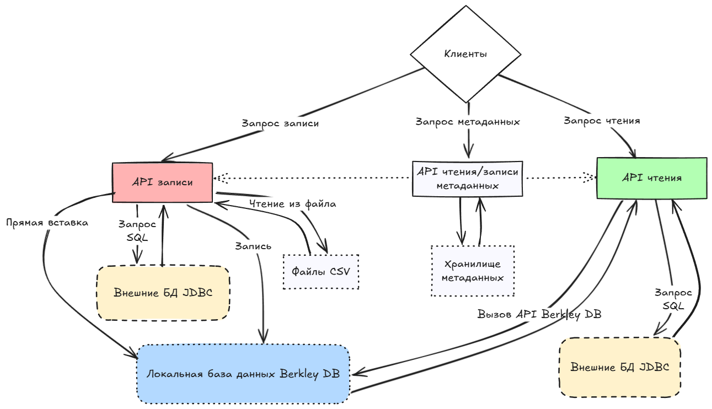

# Dimension DB


Гибридная БД блочно-колоночного типа для хранения данных временных рядов на Java

## Оглавление

- [Описание программы](#описание-программы)
  - [Общие сведения](#общие-сведения)
  - [Направления прикладного использования](#направления-прикладного-использования)
  - [Минимальные технические требования](#Минимальные-технические-требования)
  - [Начало работы с проектом](#начало-работы-с-проектом)
    - [Сборка проекта](#сборка-проекта)
    - [Использование проекта](#использование-проекта)
    - [Подготовка окружения для запуска модульных тестов](#подготовка-окружения-для-запуска-модульных-тестов)
    - [Подготовка окружения для запуска интеграционных тестов](#подготовка-окружения-для-запуска-интеграционных-тестов)
      - [PostgreSQL](#postgresql)
      - [Oracle](#oracle)
      - [MS SQL](#ms-sql)
      - [Clickhouse](#clickhouse)
      - [Загрузка тестовых данных в Clickhouse](#загрузка-тестовых-данных-в-clickhouse)
  - [Описание логической структуры](#описание-логической-структуры)
    - [Архитектура БД](#архитектура-БД)
      - [Формат хранения данных](#формат-хранения-данных)
    - [Алгоритмы](#алгоритмы)
      - [Алгоритм инициализации БД](#алгоритм-инициализации-бд)
    - [API программы](#api-программы)
      - [Диаграмма последовательности API](#диаграмма-последовательности-api)
      - [Используемые методы](#используемые-методы)
        - [Интерфейс DStore](#интерфейс-dstore)
        - [Класс Dimension DB](#класс-dimension-db)
        - [Параметры](#параметры)
          - [Тип таблицы - enum TType](#тип-таблицы---enum-ttype)
          - [Тип индексирования таблицы - enum IType](#тип-индексирования-таблицы---enum-itype)
          - [Тип способа анализа данных по таблице - enum AType](#тип-способа-анализа-данных-по-таблице---enum-atype)
          - [Тип backend таблицы - enum BType](#тип-backend-таблицы---enum-btype)
          - [Тип функции группировки данных - enum GroupFunction](#тип-функции-группировки-данных---enum-groupfunction)
          - [Параметры хранения столбца таблицы - класс CSType](#параметры-хранения-столбца-таблицы---класс-cstype)
            - [Тип хранения данных - enum SType](#тип-хранения-данных---enum-stype)
            - [Тип хранения данных Java - enum CType](#тип-хранения-данных-java---enum-ctype)
            - [Тип хранения данных JDBC - enum DataType](#тип-хранения-данных-jdbc---enum-datatype)
        - [Входные параметры](#входные-параметры)
          - [Настройки БД - класс Dimension DBConfig](#настройки-бд---класс-dimension-dbconfig)
          - [Настройки таблицы SProfile](#настройки-таблицы-sprofile)
        - [Выходные параметры](#выходные-параметры)
          - [Настройки таблицы - класс TProfile](#настройки-таблицы---класс-tprofile)
          - [Настройки столбца таблицы - класс CProfile](#настройки-столбца-таблицы---класс-cprofile)
          - [Объект для получения агрегатов данных из stacked API - класс StackedColumn](#объект-для-получения-агрегатов-данных-из-stacked-api---класс-stackedcolumn)
          - [Объект для получения агрегатов данных из gantt API - классы GanttColumnCount и GanttColumnSum](#объект-для-получения-агрегатов-данных-из-gantt-api---классы-ganttcolumncount-и-ganttcolumnsum)
    - [Варианты использования кода](#варианты-использования-кода)
    - [Производительность](#производительность)
- [Загрузка](#загрузка)
- [Разработка](#разработка)
- [Документация](#документация)
- [Лицензия](#лицензия)
- [Контакты](#контакты)

## Описание программы

### Общие сведения
Dimension DB - гибридная колоночная база данных для хранения данных временных рядов. Написана на языке программирования Java.

Ключевые особенности:
- Колоночный формат хранения данных;
- Хранение данных временных рядов;
- Формат хранения с встроенной поддержкой дедупликации данных и сжатия;
- Установка формата хранения на уровне таблицы и блока;
- Автоматический выбор алгоритма дедупликации на основе собираемых данных;
- Использование для локального хранения в качестве backend базы данных Berkley DB;
- Поддержка основных типов данных JDBC для БД PostgreSQL, Oracle, MS SQL и ClickHouse;
- В режиме «только для чтения» автоматическое формирование SQL запросов к таблицам с данными временных рядов;

[Вернуться в Оглавление](#Оглавление)

### Направления прикладного использования
Библиотека может использоваться в качестве легковесной аналитической базы данных для backend систем обработки данных на платформе Java для решения следующих прикладных задач;
- хранения собранных данных и аналитической обработки небольших и среднего объема данных для различных встроенных приложений на Java;
- хранение и обработка данных "Интернета вещей" (англ. Internet of Things, IoT) на самих устройствах в качестве временного хранилища, кэша и других задач, связанных с локальной обработкой данных;
- хранилище метаданных для выполнения запросов во внешних источниках данных с помощью автоматической генерации SQL по модели данных для аналитических приложений.
[Вернуться в Оглавление](#Оглавление)

## Минимальные технические требования
**Dimension DB** совместим с Java 25+ и поставляется с небольшим набором зависимостей.

### Требования к аппаратному обеспечению

Таблица 1. Требования к аппаратному обеспечению

| Параметр        | Описание                                                                                                        |
|:----------------|:----------------------------------------------------------------------------------------------------------------|
| CPU и ОЗУ       | Процессор частотой не ниже 500 МHz и объем памяти не ниже 250 Мб, в зависимости от объема обрабатываемых данных |
| Архитектура CPU | Intel 64-bit (x86_64), AMD 64-bit (x86_64), Arm 64-bit (aarch64)                                                |
| Диск            | Размер диска в зависимости от объема обрабатываемых данных                                                      |

### Требования к программному обеспечению

Таблица 2. Требования к программному обеспечению

| ПО    | Требования                  |
|:------|:----------------------------|
| Java  | Версия Java 25+             |
| Maven | Не ниже 3 версии            |
| Git   | Последняя актуальная версия |

### Требования к операционному обеспечению

Таблица 3. Требования к операционному обеспечению

| ПО                   | Требования                  |
|:---------------------|:----------------------------|
| Операционная система | Windows, Linux, MacOS       |

[Вернуться в Оглавление](#Оглавление)

### Начало работы с проектом

#### Сборка проекта
Проверьте, что у вас установлено ПО JDK 24+, Maven и Git последней версии
  ```shell
    java -version
    mvn -version
    git --version
  ```

Скачайте исходные коды репозитория Dimension DB:
  ```shell
    git clone <<url>>
    cd Dimension DB
  ```

Для компиляции исходного кода проекта выполните:
  ```shell
    mvn clean compile
  ```

Для запуска модульных тестов выполните:
  ```shell
    mvn clean test 
  ```

Для сборки проекта в jar-файл **Dimension DB** выполните:
  ```shell
    mvn clean package
  ```

Для сборки и установки jar-файла **Dimension DB** в локальный репозиторий Maven выполните:
  ```shell
    mvn clean install
  ```

Примечания:
- Сборка проекта может включать запуск модульных тестов **Dimension DBRunnerTest** и **DBaseRunnerUseCasesTest**, выполнение которых занимает примерно 25 минут.
- Большая часть этого времени выполняются 45 тестов с различными конфигурациями в классе **DimensionDBRunnerTest**.
- Оба теста, **Dimension DBRunnerTest** и **DBaseRunnerUseCasesTest**, по умолчанию отключены с помощью аннотации **@Disabled**.
- Класс **DimensionDBRunnerTest** содержит инфраструктуру для запуска тестов с различными комбинациями параметров (permutation):

Таблица 4. Параметры и статистика для тестов **Dimension DBRunnerTest**

| Имя теста              | Уровень перестановок | Кол-во конфигураций | Всего тестов | Время выполнения |
|------------------------|----------------------|---------------------|--------------|------------------|
| testPermutationNone    | NONE                 | 108                 | 4 860        | ~ 9 секунд       |
| testPermutationPartial | PARTIAL              | 1 944               | 87 480       | ~ 2 минуты       |
| testPermutationAll     | ALL                  | 26 244              | 1 180 980    | ~ 25 минут       |

- Чтобы сократить время сборки, используйте следующие команды Maven:
```shell
    # Пропустить DimensionDBRunnerTest во время фазы тестирования
    mvn clean test -Dtest=!DimensionDBRunnerTest

    # Пропустить во время упаковки (packaging)
    mvn clean package -Dtest=!DimensionDBRunnerTest

    # Пропустить во время установки (installation)
    mvn clean install -Dtest=!DimensionDBRunnerTest
  ```

[Вернуться в Оглавление](#Оглавление)

#### Использование проекта
Для использования БД **Dimension DB** в Java приложении необходим добавить jar-файл в качестве зависимости в файл настроек Maven pom.xml

Добавьте jar-файл **Dimension DB** в качестве зависимости в файл настроек pom.xml вашего проекта:
```xml
<?xml version="1.0" encoding="UTF-8"?>
<project>
  <properties>
    <dimension-db-version>25.7.1</dimension-db-version>
  </properties>
  <!--.....-->
  <!--.....-->
  <!--.....-->
  <dependencies>
    <dependency>
      <groupId>ru.dimension</groupId>
      <artifactId>Dimension DB</artifactId>
      <version>{Dimension DB-version}</version>
    </dependency>
  </dependencies>
</project>
```

Примечания:
- Для сборки и установки последней актуальной версии библиотеки **Dimension DB** в локальный репозиторий Maven скачайте исходные коды приложения и выполните:
  ```shell
    mvn clean install
  ```
Подробности по сборке и установке проекта описаны в разделе [Сборка проекта](#сборка-проекта)
- Полный список вариантов использования Dimension DB в вашем приложении вы можете найти в разделе [Варианты использования кода](#Варианты-использования-кода).

[Вернуться в Оглавление](#Оглавление)

#### Подготовка окружения для запуска модульных тестов
Для запуска модульных тестов необходимо выполнить шаги по сборке проекта из раздела [Сборка проекта](#сборка-проекта)

[Вернуться в Оглавление](#Оглавление)

#### Подготовка окружения для запуска интеграционных тестов
Подготовка окружения для запуска интеграционных тестов требует локальной установки баз данных с помощью Docker Desktop

Инструкция по установке Docker Desktop для [Windows](https://docs.docker.com/desktop/install/windows-install/) и [Linux](https://docs.docker.com/desktop/install/linux/)

[Вернуться в Оглавление](#Оглавление)

##### PostgreSQL
Установить и запустить контейнер с БД PostgreSQL

  ```shell
    docker run -d --name db \
    -e 'POSTGRES_PASSWORD=postgres' \
    -p 5432:5432 \
    -v pgdata:/var/lib/postgresql/data \
    postgres \
    postgres -c 'max_connections=200'
  ```

[Вернуться в Оглавление](#Оглавление)

##### Oracle
- Установить локально [репозиторий](https://github.com/oracle/docker-images) скриптов для установки БД Oracle
- Скачать дистрибутив БД с сайта [Oracle](https://www.oracle.com/database/technologies/oracle19c-linux-downloads.html). Для платформы Linux x86 и версии БД 19.3 файл LINUX.X64_193000_db_home.zip скопировать в локальную директорию репозитория скриптов OracleDatabase/SingleInstance/dockerfiles/19.3.0
- Запустить скрипт buildContainerImage.sh из репозитория скриптов и указать параметры (пример для версии БД 19.3.0)
```shell
    OracleDatabase/SingleInstance/dockerfiles/buildContainerImage.sh -v 19.3.0 -e -i
  ```
- Установить и запустить контейнер с инстансом БД Oracle из командной строки (пример запуска команды Docker run для версии БД 19.3.0)
```shell
    docker run --name database19ee  \
    -p 1523:1521 -p 5522:5500 -e  \
    ORACLE_SID=orcl -e ORACLE_PDB=pdb_orcl -e ORACLE_PWD=sys  \
    -e ORACLE_CHARACTERSET=AL32UTF8  \
    -v /opt/oracle/oradata oracle/database:19.3.0-ee
  ```

[Вернуться в Оглавление](#Оглавление)

##### MS SQL
Установить и запустить контейнер с БД MS SQL
  ```shell
    docker run -e 'ACCEPT_EULA=Y' \
    -e 'SA_PASSWORD=QOEfSsa51234!' \
    -p 1433:1433 \
    -v |(pwd)/drive:/var/opt/mssql/data \
    --name mssql \
    mcr.microsoft.com/mssql/server
  ```

[Вернуться в Оглавление](#Оглавление)

##### Clickhouse
Установить и запустить контейнер с БД Clickhouse
  ```shell
    docker run -d --name clickhouse-server \
    -e CLICKHOUSE_USER=admin -e CLICKHOUSE_DEFAULT_ACCESS_MANAGEMENT=1 -e CLICKHOUSE_PASSWORD=admin \
    -p 8123:8123 -p 9000:9000 \
    -v C:\clickhouse:/var/lib/clickhouse clickhouse/clickhouse-server
  ```

[Вернуться в Оглавление](#Оглавление)

##### Загрузка тестовых данных в Clickhouse
- Установить [Clickhouse](#clickhouse) локально и проверить подключение к ClickHouse на локальном ПК по URL **"jdbc:clickhouse://localhost:8123"** или использовать другую строку подключения и внести изменения в тесты;
- Загрузить тестовые данные [Заказы такси Нью-Йорка](https://clickhouse.com/docs/en/getting-started/example-datasets/nyc-taxi#download-of-prepared-partitions) в локальный экземпляр ClickHouse (используется формат предварительно подготовленных разделов, загруженных в схему datasets);
- Проверить что данные загрузились `clickhouse-client --query "select count(*) from datasets.trips_mergetree"`;
- Создать директорию для локального хранения данных **Dimension DB** (пример для Windows) **"C:\\Users\\.temp"**;
- Загрузить тестовые данные в локальную БД **Dimension DB**, используя любой из методов в **Dimension DBCHLoadDataTest**, помеченный аннотацией @Test;
– Запустить интеграционные тесты в **Dimension DBCHQueryGanttTest**, **Dimension DBCHQueryStackedTest** или **Dimension DBCHQueryRawTest** которые помечены аннотацией @Test;

Примечания:
- В интеграционных тестах используется аннотация **@Disabled** для отключения их при запуске модульных тестов Dimension DB, при необходимости ее следует удалить для корректной загрузки данных и тестирования.
- Тестовые данные таблицы trips_mergetree загружаются в схему datasets
  ```
    CREATE DATABASE datasets;
  ```
- Определение таблицы trips_mergetree

<details>
  <summary>CREATE TABLE trips_mergetree</summary>

```
    CREATE TABLE trips_mergetree (
      trip_id UInt32,
      vendor_id Enum8('1' = 1, '2' = 2, 'CMT' = 3, 'VTS' = 4, 'DDS' = 5, 'B02512' = 10, 'B02598' = 11, 'B02617' = 12, 'B02682' = 13, 'B02764' = 14),
      pickup_date Date,
      pickup_datetime DateTime,
      dropoff_date Date,
      dropoff_datetime DateTime,
      store_and_fwd_flag UInt8,
      rate_code_id UInt8,
      pickup_longitude Float64,
      pickup_latitude Float64,
      dropoff_longitude Float64,
      dropoff_latitude Float64,
      passenger_count UInt8,
      trip_distance Float64,
      fare_amount Float32,
      extra Float32,
      mta_tax Float32,
      tip_amount Float32,
      tolls_amount Float32,
      ehail_fee Float32,
      improvement_surcharge Float32,
      total_amount Float32,
      payment_type_ Enum8('UNK' = 0, 'CSH' = 1, 'CRE' = 2, 'NOC' = 3, 'DIS' = 4),
      trip_type UInt8,
      pickup FixedString(25),
      dropoff FixedString(25),
      cab_type Enum8('yellow' = 1, 'green' = 2, 'uber' = 3),
      pickup_nyct2010_gid UInt8,
      pickup_ctlabel Float32,
      pickup_borocode UInt8,
      pickup_boroname Enum8('' = 0, 'Manhattan' = 1, 'Bronx' = 2, 'Brooklyn' = 3, 'Queens' = 4, 'Staten Island' = 5),
      pickup_ct2010 FixedString(6),
      pickup_boroct2010 FixedString(7),
      pickup_cdeligibil Enum8(' ' = 0, 'E' = 1, 'I' = 2),
      pickup_ntacode FixedString(4),
      pickup_ntaname Enum16('' = 0, 'Airport' = 1, 'Allerton-Pelham Gardens' = 2, 'Annadale-Huguenot-Prince\'s Bay-Eltingville' = 3, 'Arden Heights' = 4, 'Astoria' = 5, 'Auburndale' = 6, 'Baisley Park' = 7, 'Bath Beach' = 8, 'Battery Park City-Lower Manhattan' = 9, 'Bay Ridge' = 10, 'Bayside-Bayside Hills' = 11, 'Bedford' = 12, 'Bedford Park-Fordham North' = 13, 'Bellerose' = 14, 'Belmont' = 15, 'Bensonhurst East' = 16, 'Bensonhurst West' = 17, 'Borough Park' = 18, 'Breezy Point-Belle Harbor-Rockaway Park-Broad Channel' = 19, 'Briarwood-Jamaica Hills' = 20, 'Brighton Beach' = 21, 'Bronxdale' = 22, 'Brooklyn Heights-Cobble Hill' = 23, 'Brownsville' = 24, 'Bushwick North' = 25, 'Bushwick South' = 26, 'Cambria Heights' = 27, 'Canarsie' = 28, 'Carroll Gardens-Columbia Street-Red Hook' = 29, 'Central Harlem North-Polo Grounds' = 30, 'Central Harlem South' = 31, 'Charleston-Richmond Valley-Tottenville' = 32, 'Chinatown' = 33, 'Claremont-Bathgate' = 34, 'Clinton' = 35, 'Clinton Hill' = 36, 'Co-op City' = 37, 'College Point' = 38, 'Corona' = 39, 'Crotona Park East' = 40, 'Crown Heights North' = 41, 'Crown Heights South' = 42, 'Cypress Hills-City Line' = 43, 'DUMBO-Vinegar Hill-Downtown Brooklyn-Boerum Hill' = 44, 'Douglas Manor-Douglaston-Little Neck' = 45, 'Dyker Heights' = 46, 'East Concourse-Concourse Village' = 47, 'East Elmhurst' = 48, 'East Flatbush-Farragut' = 49, 'East Flushing' = 50, 'East Harlem North' = 51, 'East Harlem South' = 52, 'East New York' = 53, 'East New York (Pennsylvania Ave)' = 54, 'East Tremont' = 55, 'East Village' = 56, 'East Williamsburg' = 57, 'Eastchester-Edenwald-Baychester' = 58, 'Elmhurst' = 59, 'Elmhurst-Maspeth' = 60, 'Erasmus' = 61, 'Far Rockaway-Bayswater' = 62, 'Flatbush' = 63, 'Flatlands' = 64, 'Flushing' = 65, 'Fordham South' = 66, 'Forest Hills' = 67, 'Fort Greene' = 68, 'Fresh Meadows-Utopia' = 69, 'Ft. Totten-Bay Terrace-Clearview' = 70, 'Georgetown-Marine Park-Bergen Beach-Mill Basin' = 71, 'Glen Oaks-Floral Park-New Hyde Park' = 72, 'Glendale' = 73, 'Gramercy' = 74, 'Grasmere-Arrochar-Ft. Wadsworth' = 75, 'Gravesend' = 76, 'Great Kills' = 77, 'Greenpoint' = 78, 'Grymes Hill-Clifton-Fox Hills' = 79, 'Hamilton Heights' = 80, 'Hammels-Arverne-Edgemere' = 81, 'Highbridge' = 82, 'Hollis' = 83, 'Homecrest' = 84, 'Hudson Yards-Chelsea-Flatiron-Union Square' = 85, 'Hunters Point-Sunnyside-West Maspeth' = 86, 'Hunts Point' = 87, 'Jackson Heights' = 88, 'Jamaica' = 89, 'Jamaica Estates-Holliswood' = 90, 'Kensington-Ocean Parkway' = 91, 'Kew Gardens' = 92, 'Kew Gardens Hills' = 93, 'Kingsbridge Heights' = 94, 'Laurelton' = 95, 'Lenox Hill-Roosevelt Island' = 96, 'Lincoln Square' = 97, 'Lindenwood-Howard Beach' = 98, 'Longwood' = 99, 'Lower East Side' = 100, 'Madison' = 101, 'Manhattanville' = 102, 'Marble Hill-Inwood' = 103, 'Mariner\'s Harbor-Arlington-Port Ivory-Graniteville' = 104, 'Maspeth' = 105, 'Melrose South-Mott Haven North' = 106, 'Middle Village' = 107, 'Midtown-Midtown South' = 108, 'Midwood' = 109, 'Morningside Heights' = 110, 'Morrisania-Melrose' = 111, 'Mott Haven-Port Morris' = 112, 'Mount Hope' = 113, 'Murray Hill' = 114, 'Murray Hill-Kips Bay' = 115, 'New Brighton-Silver Lake' = 116, 'New Dorp-Midland Beach' = 117, 'New Springville-Bloomfield-Travis' = 118, 'North Corona' = 119, 'North Riverdale-Fieldston-Riverdale' = 120, 'North Side-South Side' = 121, 'Norwood' = 122, 'Oakland Gardens' = 123, 'Oakwood-Oakwood Beach' = 124, 'Ocean Hill' = 125, 'Ocean Parkway South' = 126, 'Old Astoria' = 127, 'Old Town-Dongan Hills-South Beach' = 128, 'Ozone Park' = 129, 'Park Slope-Gowanus' = 130, 'Parkchester' = 131, 'Pelham Bay-Country Club-City Island' = 132, 'Pelham Parkway' = 133, 'Pomonok-Flushing Heights-Hillcrest' = 134, 'Port Richmond' = 135, 'Prospect Heights' = 136, 'Prospect Lefferts Gardens-Wingate' = 137, 'Queens Village' = 138, 'Queensboro Hill' = 139, 'Queensbridge-Ravenswood-Long Island City' = 140, 'Rego Park' = 141, 'Richmond Hill' = 142, 'Ridgewood' = 143, 'Rikers Island' = 144, 'Rosedale' = 145, 'Rossville-Woodrow' = 146, 'Rugby-Remsen Village' = 147, 'Schuylerville-Throgs Neck-Edgewater Park' = 148, 'Seagate-Coney Island' = 149, 'Sheepshead Bay-Gerritsen Beach-Manhattan Beach' = 150, 'SoHo-TriBeCa-Civic Center-Little Italy' = 151, 'Soundview-Bruckner' = 152, 'Soundview-Castle Hill-Clason Point-Harding Park' = 153, 'South Jamaica' = 154, 'South Ozone Park' = 155, 'Springfield Gardens North' = 156, 'Springfield Gardens South-Brookville' = 157, 'Spuyten Duyvil-Kingsbridge' = 158, 'St. Albans' = 159, 'Stapleton-Rosebank' = 160, 'Starrett City' = 161, 'Steinway' = 162, 'Stuyvesant Heights' = 163, 'Stuyvesant Town-Cooper Village' = 164, 'Sunset Park East' = 165, 'Sunset Park West' = 166, 'Todt Hill-Emerson Hill-Heartland Village-Lighthouse Hill' = 167, 'Turtle Bay-East Midtown' = 168, 'University Heights-Morris Heights' = 169, 'Upper East Side-Carnegie Hill' = 170, 'Upper West Side' = 171, 'Van Cortlandt Village' = 172, 'Van Nest-Morris Park-Westchester Square' = 173, 'Washington Heights North' = 174, 'Washington Heights South' = 175, 'West Brighton' = 176, 'West Concourse' = 177, 'West Farms-Bronx River' = 178, 'West New Brighton-New Brighton-St. George' = 179, 'West Village' = 180, 'Westchester-Unionport' = 181, 'Westerleigh' = 182, 'Whitestone' = 183, 'Williamsbridge-Olinville' = 184, 'Williamsburg' = 185, 'Windsor Terrace' = 186, 'Woodhaven' = 187, 'Woodlawn-Wakefield' = 188, 'Woodside' = 189, 'Yorkville' = 190, 'park-cemetery-etc-Bronx' = 191, 'park-cemetery-etc-Brooklyn' = 192, 'park-cemetery-etc-Manhattan' = 193, 'park-cemetery-etc-Queens' = 194, 'park-cemetery-etc-Staten Island' = 195),
      pickup_puma UInt16,
      dropoff_nyct2010_gid UInt8,
      dropoff_ctlabel Float32,
      dropoff_borocode UInt8,
      dropoff_boroname Enum8('' = 0, 'Manhattan' = 1, 'Bronx' = 2, 'Brooklyn' = 3, 'Queens' = 4, 'Staten Island' = 5),
      dropoff_ct2010 FixedString(6),
      dropoff_boroct2010 FixedString(7),
      dropoff_cdeligibil Enum8(' ' = 0, 'E' = 1, 'I' = 2),
      dropoff_ntacode FixedString(4),
      dropoff_ntaname Enum16('' = 0, 'Airport' = 1, 'Allerton-Pelham Gardens' = 2, 'Annadale-Huguenot-Prince\'s Bay-Eltingville' = 3, 'Arden Heights' = 4, 'Astoria' = 5, 'Auburndale' = 6, 'Baisley Park' = 7, 'Bath Beach' = 8, 'Battery Park City-Lower Manhattan' = 9, 'Bay Ridge' = 10, 'Bayside-Bayside Hills' = 11, 'Bedford' = 12, 'Bedford Park-Fordham North' = 13, 'Bellerose' = 14, 'Belmont' = 15, 'Bensonhurst East' = 16, 'Bensonhurst West' = 17, 'Borough Park' = 18, 'Breezy Point-Belle Harbor-Rockaway Park-Broad Channel' = 19, 'Briarwood-Jamaica Hills' = 20, 'Brighton Beach' = 21, 'Bronxdale' = 22, 'Brooklyn Heights-Cobble Hill' = 23, 'Brownsville' = 24, 'Bushwick North' = 25, 'Bushwick South' = 26, 'Cambria Heights' = 27, 'Canarsie' = 28, 'Carroll Gardens-Columbia Street-Red Hook' = 29, 'Central Harlem North-Polo Grounds' = 30, 'Central Harlem South' = 31, 'Charleston-Richmond Valley-Tottenville' = 32, 'Chinatown' = 33, 'Claremont-Bathgate' = 34, 'Clinton' = 35, 'Clinton Hill' = 36, 'Co-op City' = 37, 'College Point' = 38, 'Corona' = 39, 'Crotona Park East' = 40, 'Crown Heights North' = 41, 'Crown Heights South' = 42, 'Cypress Hills-City Line' = 43, 'DUMBO-Vinegar Hill-Downtown Brooklyn-Boerum Hill' = 44, 'Douglas Manor-Douglaston-Little Neck' = 45, 'Dyker Heights' = 46, 'East Concourse-Concourse Village' = 47, 'East Elmhurst' = 48, 'East Flatbush-Farragut' = 49, 'East Flushing' = 50, 'East Harlem North' = 51, 'East Harlem South' = 52, 'East New York' = 53, 'East New York (Pennsylvania Ave)' = 54, 'East Tremont' = 55, 'East Village' = 56, 'East Williamsburg' = 57, 'Eastchester-Edenwald-Baychester' = 58, 'Elmhurst' = 59, 'Elmhurst-Maspeth' = 60, 'Erasmus' = 61, 'Far Rockaway-Bayswater' = 62, 'Flatbush' = 63, 'Flatlands' = 64, 'Flushing' = 65, 'Fordham South' = 66, 'Forest Hills' = 67, 'Fort Greene' = 68, 'Fresh Meadows-Utopia' = 69, 'Ft. Totten-Bay Terrace-Clearview' = 70, 'Georgetown-Marine Park-Bergen Beach-Mill Basin' = 71, 'Glen Oaks-Floral Park-New Hyde Park' = 72, 'Glendale' = 73, 'Gramercy' = 74, 'Grasmere-Arrochar-Ft. Wadsworth' = 75, 'Gravesend' = 76, 'Great Kills' = 77, 'Greenpoint' = 78, 'Grymes Hill-Clifton-Fox Hills' = 79, 'Hamilton Heights' = 80, 'Hammels-Arverne-Edgemere' = 81, 'Highbridge' = 82, 'Hollis' = 83, 'Homecrest' = 84, 'Hudson Yards-Chelsea-Flatiron-Union Square' = 85, 'Hunters Point-Sunnyside-West Maspeth' = 86, 'Hunts Point' = 87, 'Jackson Heights' = 88, 'Jamaica' = 89, 'Jamaica Estates-Holliswood' = 90, 'Kensington-Ocean Parkway' = 91, 'Kew Gardens' = 92, 'Kew Gardens Hills' = 93, 'Kingsbridge Heights' = 94, 'Laurelton' = 95, 'Lenox Hill-Roosevelt Island' = 96, 'Lincoln Square' = 97, 'Lindenwood-Howard Beach' = 98, 'Longwood' = 99, 'Lower East Side' = 100, 'Madison' = 101, 'Manhattanville' = 102, 'Marble Hill-Inwood' = 103, 'Mariner\'s Harbor-Arlington-Port Ivory-Graniteville' = 104, 'Maspeth' = 105, 'Melrose South-Mott Haven North' = 106, 'Middle Village' = 107, 'Midtown-Midtown South' = 108, 'Midwood' = 109, 'Morningside Heights' = 110, 'Morrisania-Melrose' = 111, 'Mott Haven-Port Morris' = 112, 'Mount Hope' = 113, 'Murray Hill' = 114, 'Murray Hill-Kips Bay' = 115, 'New Brighton-Silver Lake' = 116, 'New Dorp-Midland Beach' = 117, 'New Springville-Bloomfield-Travis' = 118, 'North Corona' = 119, 'North Riverdale-Fieldston-Riverdale' = 120, 'North Side-South Side' = 121, 'Norwood' = 122, 'Oakland Gardens' = 123, 'Oakwood-Oakwood Beach' = 124, 'Ocean Hill' = 125, 'Ocean Parkway South' = 126, 'Old Astoria' = 127, 'Old Town-Dongan Hills-South Beach' = 128, 'Ozone Park' = 129, 'Park Slope-Gowanus' = 130, 'Parkchester' = 131, 'Pelham Bay-Country Club-City Island' = 132, 'Pelham Parkway' = 133, 'Pomonok-Flushing Heights-Hillcrest' = 134, 'Port Richmond' = 135, 'Prospect Heights' = 136, 'Prospect Lefferts Gardens-Wingate' = 137, 'Queens Village' = 138, 'Queensboro Hill' = 139, 'Queensbridge-Ravenswood-Long Island City' = 140, 'Rego Park' = 141, 'Richmond Hill' = 142, 'Ridgewood' = 143, 'Rikers Island' = 144, 'Rosedale' = 145, 'Rossville-Woodrow' = 146, 'Rugby-Remsen Village' = 147, 'Schuylerville-Throgs Neck-Edgewater Park' = 148, 'Seagate-Coney Island' = 149, 'Sheepshead Bay-Gerritsen Beach-Manhattan Beach' = 150, 'SoHo-TriBeCa-Civic Center-Little Italy' = 151, 'Soundview-Bruckner' = 152, 'Soundview-Castle Hill-Clason Point-Harding Park' = 153, 'South Jamaica' = 154, 'South Ozone Park' = 155, 'Springfield Gardens North' = 156, 'Springfield Gardens South-Brookville' = 157, 'Spuyten Duyvil-Kingsbridge' = 158, 'St. Albans' = 159, 'Stapleton-Rosebank' = 160, 'Starrett City' = 161, 'Steinway' = 162, 'Stuyvesant Heights' = 163, 'Stuyvesant Town-Cooper Village' = 164, 'Sunset Park East' = 165, 'Sunset Park West' = 166, 'Todt Hill-Emerson Hill-Heartland Village-Lighthouse Hill' = 167, 'Turtle Bay-East Midtown' = 168, 'University Heights-Morris Heights' = 169, 'Upper East Side-Carnegie Hill' = 170, 'Upper West Side' = 171, 'Van Cortlandt Village' = 172, 'Van Nest-Morris Park-Westchester Square' = 173, 'Washington Heights North' = 174, 'Washington Heights South' = 175, 'West Brighton' = 176, 'West Concourse' = 177, 'West Farms-Bronx River' = 178, 'West New Brighton-New Brighton-St. George' = 179, 'West Village' = 180, 'Westchester-Unionport' = 181, 'Westerleigh' = 182, 'Whitestone' = 183, 'Williamsbridge-Olinville' = 184, 'Williamsburg' = 185, 'Windsor Terrace' = 186, 'Woodhaven' = 187, 'Woodlawn-Wakefield' = 188, 'Woodside' = 189, 'Yorkville' = 190, 'park-cemetery-etc-Bronx' = 191, 'park-cemetery-etc-Brooklyn' = 192, 'park-cemetery-etc-Manhattan' = 193, 'park-cemetery-etc-Queens' = 194, 'park-cemetery-etc-Staten Island' = 195),
      dropoff_puma UInt16
    ) ENGINE = MergeTree() ORDER BY (pickup_date, pickup_datetime);
```
</details>

[Вернуться в Оглавление](#Оглавление)

### Описание логической структуры

#### Архитектура БД


<details>
  <summary>Mermaid flow chart</summary>


</details>

[Вернуться в Оглавление](#Оглавление)

##### Формат хранения данных


Поддерживаются три формата хранения данных:
- **RAW** — когда данные хранятся в виде ключа Java-типа **int** для строковых данных и подходящий Java-тип для остальных (числовые, специальные и проч.);
- **ENUM** — когда данные хранятся в виде ключа Java-типа **byte** значения;
- **HISTOGRAM** — когда сохраняются начальный и конечный индекс повторяющихся данных из диапазона и само значение.

Метаданные формата хранения, типа индексации и сжатия хранятся в заголовке блока.

[Вернуться в Оглавление](#Оглавление)

#### Алгоритмы
Основные методы Java API БД Dimension DB размещены в интерфейсе **DStore**. 
Доступ к **DStore** необходимо получить после инициализации БД Dimension DB через вызов конструктора класса **Dimension DB**, примеры представлены в разделе [Алгоритм инициализации БД](#алгоритм-инициализации-бд).

Полный список методов основных классов и интерфейсов с входными и выходными параметрами размещен в разделе [Используемые методы](#используемые-методы).

##### Алгоритм инициализации БД
1. Определить локальную директорию для хранения настроек БД Dimension DB;
2. Создать конфигурацию БД Dimension DB **Dimension DBConfig**;
3. Выполнить инициализацию backend БД; 
4. Выполнить инициализацию БД Dimension DB через вызов конструктора из класса **Dimension DB**;
5. Получить ссылку на интерфейс **DStore** из класса **Dimension DB** для доступа к Java API БД Dimension DB.

Пример инициализации БД для backend Berkley DB
```
@TempDir
static File databaseDir;
...
Dimension DBConfig Dimension DBConfig = new Dimension DBConfig().setConfigDirectory(databaseDir.getAbsolutePath());
BerkleyDB berkleyDB = new BerkleyDB(databaseDir.getAbsolutePath(), true);
Dimension DB Dimension DB = new Dimension DB(Dimension DBConfig, berkleyDB.getStore());
DStore fStore = Dimension DB.getDStore();
```

Пример инициализации БД для SQL backend ClickHouse
```
@TempDir
static File databaseDir;
...
BType bType = BType.CLICKHOUSE;
String driverClassName = "com.clickhouse.jdbc.ClickHouseDriver";
String dbUrl = "jdbc:clickhouse://localhost:8123";

SqlDB sqlDB = new SqlDB(bType, driverClassName, dbUrl, "admin", "admin");
BasicDataSource basicDataSource = sqlDB.getDatasource();
Dimension DBConfig Dimension DBConfig = new Dimension DBConfig().setConfigDirectory(databaseDir.getAbsolutePath());

Dimension DB Dimension DB = new Dimension DB(Dimension DBConfig, bType, basicDataSource);
DStore fStore = Dimension DB.getDStore();
```

Примечания:
- Временная директория **databaseDir** создается автоматически с использованием аннотации **@TempDir** библиотеки JUnit;
- Для примера с backend Berkley DB настройки Dimension DB и данные backend располагаются в одной временной директории **databaseDir**;
- Примеры кода взяты из модульных и интеграционных тестов.

[Вернуться в Оглавление](#Оглавление)

#### API программы

**Dimension DB** предлагает расширенные возможности для взаимодействия с базой данных через набор методов, способных выполнять различные задачи сохранения и извлечения данных. Эти API специально разработаны для обеспечения гибкости и оптимальной работы с временными рядами данных в Java-среде как для локально сохраненных данных, так и для внешних систем хранения данных с SQL интерфейсом.

- **Основные API**. Основные функции для работы с данными встроены в интерфейс **DStore**, который предлагает стандартизированный доступ к методам записи и чтения. **DStore** является ключевым элементом архитектуры **Dimension DB**, обеспечивающим интерфейсную точку для взаимодействия с базой данных для клиентских приложений.

- **Запись данных**. Для записи информации в базу данных Dimension DB поддерживается несколько подходов:

  - **Direct** — вставка данных в локальную БД с использованием промежуточной Java структуры данных табличного вида.
  - **JDBC** — вставка данных в локальную БД с использованием данных, получаемых из внешнего источника данных по JDBC, что позволяет осуществлять интеграцию с другими системами, способными работать с JDBC.
  - **JDBC Batch** — пакетная загрузка в локальную БД с использованием данных, получаемых из внешнего источника данных по JDBC, минимизирующая количество транзакций для масштабной вставки.

- **Чтение данных**. В процессе извлечения данных из **Dimension DB** используются API, каждый из которых оптимизирован для соответствующих типов запросов:

  - **Stacked** — получение данных на основе функций агрегации, таких как COUNT SUM и AVG, получая информацию по распределению данных по выбранным атрибутам и параметрам.
  - **Gantt** — сложный расчёт распределения с использованием агрегации COUNT по двум уровням, что полезно для анализа зависимостей и связей между разными показателями.
  - **Raw** — извлечение исходных данных в табличном формате, для просмотра детальной информации по всему массиву собранных данных.
  - **BatchResultSet** — извлечение исходных данных в табличном формате с построчным доступом, для получения только части строк из результирующего набора в БД.

- **Загрузка метаданных**. Для работы с внешними источниками данных требуется выполнять запросы к источникам по JDBC или табличным Java структурам. Для хранения информации по таблицам и типам данных, используемых для локального хранения и обращения к внешним источникам данных по JDBC используется API для загрузки и просмотра этой информации в локальный файл хранилища метаданных Dimension DB. 

API для записи данных работают только с локальным хранилищем данных типа "ключ-значение" Berkley DB. Методы API для чтения данных могут работать как с локальным хранилищем Berkley DB, так и с внешними источниками данных по JDBC с использованием автоматической генерации SQL запросов.

Таблица 5. Поддерживаемые БД для работы с API в Dimension DB

| № п.п. | Поддержка API Dimension DB | База данных          | Тип базы данных |
|--------|----------------------------|----------------------|-----------------|
| 1      | Чтение/Запись              | Berkley DB           | ключ-значение   |
| 2      | Чтение                     | ClickHouse           | аналитическая   |
| 3      | Чтение                     | Oracle               | реляционная     |
| 4      | Чтение                     | PostgreSQL           | реляционная     |
| 5      | Чтение                     | Microsoft SQL Server | реляционная     |
| 6      | Чтение                     | MySQL                | реляционная     |

Перед тем, как приступить к записи данных, необходимо установить параметры хранения и метаданные для таблиц и столбцов в объекте **SProfile**.

Конфигурация таблицы базы данных позволяет переключаться между глобальной и локальной индексацией, включать и отключать сжатие данных «на лету». Это достигается за счет размещения метаданных типа хранилища в заголовке блока для обоих типов индексации и флага для включения или отключения сжатия.

[Вернуться в Оглавление](#Оглавление)

##### Диаграмма последовательности API


<details>
  <summary>Mermaid sequence diagram</summary>


</details>

[Вернуться в Оглавление](#Оглавление)

##### Используемые методы
- В интерфейсе **DStore** находятся основные контракты и сигнатуры методов для взаимодействия БД **Dimension DB** с клиентскими приложениями;
- Инициализация объектов БД проходит при вызове конструктора класса **Dimension DB**;
- Ссылка на интерфейс **DStore** для доступа к API приложения вызывается из объекта класса **Dimension DB**.

###### Интерфейс DStore

Таблица 6. Список API для работы с базой данных Dimension DB интерфейса DStore

| #  | Название метода         | Тип API    | Описание                                          | Входные параметры                                                                                                                 | Выходные параметры                    |
|----|-------------------------|------------|---------------------------------------------------|-----------------------------------------------------------------------------------------------------------------------------------|---------------------------------------|
| 1  | getTProfile             | Метаданные | Получить метаданные таблицы по имени              | String tableName                                                                                                                  | TProfile                              |
| 2  | loadDirectTableMetadata | Метаданные | Загрузить метаданные из SProfile                  | SProfile sProfile                                                                                                                 | TProfile                              |
| 3  | loadJdbcTableMetadata   | Метаданные | Загрузить метаданные через JDBC с запросом        | Connection connection, String query, SProfile sProfile                                                                            | TProfile                              |
| 4  | loadJdbcTableMetadata   | Метаданные | Загрузить метаданные через JDBC (схема и таблица) | Connection connection, String sqlSchemaName, String sqlTableName, SProfile sProfile                                               | TProfile                              |
| 5  | setTimestampColumn      | Метаданные | Установить столбец с метками времени              | String tableName, String timestampColumnName                                                                                      | void                                  |
| 6  | putDataDirect           | Запись     | Сохранить данные с использованием Java-структуры  | String tableName, List<List<Object>> data                                                                                         | void                                  |
| 7  | putDataJdbc             | Запись     | Сохранить данные из JDBC ResultSet                | String tableName, ResultSet resultSet                                                                                             | long (метка времени последней строки) |
| 8  | putDataJdbcBatch        | Запись     | Пакетное сохранение из JDBC ResultSet             | String tableName, ResultSet resultSet, Integer batchSize                                                                          | void                                  |
| 9  | getBlockKeyTailList     | Чтение     | Получить блоки с ключами и диапазонами            | String tableName, long begin, long end                                                                                            | List<BlockKeyTail>                    |
| 10 | getStacked              | Чтение     | Получить агрегированные данные                    | String tableName, CProfile cProfile, GroupFunction groupFunction, CompositeFilter compositeFilter, long begin, long end           | List<StackedColumn>                   |
| 11 | getGanttCount           | Чтение     | Двухуровневая группировка COUNT                   | String tableName, CProfile firstGrpBy, CProfile secondGrpBy, CompositeFilter compositeFilter, long begin, long end                | List<GanttColumnCount>                |
| 12 | getGanttCount           | Чтение     | Двухуровневая группировка COUNT (многопоточная)   | String tableName, CProfile firstGrpBy, CProfile secondGrpBy, CompositeFilter compositeFilter, int batchSize, long begin, long end | List<GanttColumnCount>                |
| 13 | getGanttSum             | Чтение     | Двухуровневая группировка SUM                     | String tableName, CProfile firstGrpBy, CProfile secondGrpBy, CompositeFilter compositeFilter, long begin, long end                | List<GanttColumnSum>                  |
| 14 | getDistinct             | Чтение     | Получить уникальные значения                      | String tableName, CProfile cProfile, OrderBy orderBy, CompositeFilter compositeFilter, int limit, long begin, long end            | List<String>                          |
| 15 | getRawDataAll           | Чтение     | Получить сырые данные (все столбцы, без фильтра)  | String tableName, long begin, long end                                                                                            | List<List<Object>>                    |
| 16 | getRawDataAll           | Чтение     | Получить сырые данные (все столбцы, с фильтром)   | String tableName, CProfile cProfileFilter, String filter, long begin, long end                                                    | List<List<Object>>                    |
| 17 | getRawDataByColumn      | Чтение     | Получить сырые данные для конкретного столбца     | String tableName, CProfile cProfile, long begin, long end                                                                         | List<List<Object>>                    |
| 18 | getBatchResultSet       | Чтение     | Пакетное чтение (обычные таблицы)                 | String tableName, int fetchSize                                                                                                   | BatchResultSet                        |
| 19 | getBatchResultSet       | Чтение     | Пакетное чтение (time-series таблицы)             | String tableName, long begin, long end, int fetchSize                                                                             | BatchResultSet                        |
| 20 | getFirst                | Метаданные | Получить первую метку времени                     | String tableName, long begin, long end                                                                                            | long                                  |
| 21 | getLast                 | Метаданные | Получить последнюю метку времени                  | String tableName, long begin, long end                                                                                            | long                                  |
| 22 | syncBackendDb           | Бэкенд     | Синхронизировать Berkley DB с диском              | -                                                                                                                                 | void                                  |
| 23 | closeBackendDb          | Бэкенд     | Закрыть Berkley DB                                | -                                                                                                                                 | void                                  |

[Вернуться в Оглавление](#Оглавление)

###### Класс Dimension DB

Таблица 7. Класс Dimension DB, в котором проходит инициализация объектов БД

| № п.п | Название конструктора |    Тип API    | Описание                                                        | Входные параметры                                                                                                                                                                                                        | Выходные параметры |
|:-----:|:----------------------|:-------------:|:----------------------------------------------------------------|:-------------------------------------------------------------------------------------------------------------------------------------------------------------------------------------------------------------------------|:-------------------|
|   1   | Dimension DB          | Чтение/Запись | Создать хранилище Dimension DB для backend Berkley DB           | Dimension DBConfig Dimension DBConfig - конфигурация локального хранения Dimension DB,<br> EntityStore - хранилище данных Berkley DB                                                                                     | Конструктор        |
|   2   | Dimension DB          |    Чтение     | Создать хранилище Dimension DB для определенного типа backend-а | Dimension DBConfig Dimension DBConfig - конфигурация локального хранения Dimension DB,<br> BType backendType - тип backend-а для чтения,<br> BasicDataSource basicDataSource - объект пула подключений JDBC Apache DBCP2 | Конструктор        |

[Вернуться в Оглавление](#Оглавление)

###### Параметры

###### Тип таблицы - enum TType

Таблица 8. Enum TType для хранения поддерживаемых типов таблиц

| Имя свойства | Тип   | Описание                                    |
|--------------|-------|---------------------------------------------|
| REGULAR      | TType | Таблица для хранения обычных таблиц         |
| TIME_SERIES  | TType | Таблица для хранения данных временных рядов |

[Вернуться в Оглавление](#Оглавление)

###### Тип индексирования таблицы - enum IType

Таблица 9. Enum IType для хранения типа индексирования таблицы

| Имя свойства | Тип   | Описание                                                                                                                                          |
|--------------|-------|---------------------------------------------------------------------------------------------------------------------------------------------------|
| GLOBAL       | IType | Тип используемого индекса (RAW, HISTOGRAM, ENUM), определяется пользователем на уровне таблицы для каждого столбца во входных параметрах SProfile |
| LOCAL        | IType | Тип используемого индекса (RAW, HISTOGRAM, ENUM), определяется автоматически системой на уровне блока данных для каждого столбца таблицы          |

[Вернуться в Оглавление](#Оглавление)

###### Тип способа анализа данных по таблице - enum AType

Таблица 10. Enum AType для хранения способа анализа данных для локального индексирования

| Имя свойства   | Тип   | Описание                                                                                                                                                                                                      |
|----------------|-------|---------------------------------------------------------------------------------------------------------------------------------------------------------------------------------------------------------------|
| ON_LOAD        | AType | Данные анализируются при первом получении данных, и на их основе определяется тип индексирования по каждому столбцу таблицы                                                                                   |
| FULL_PASS_ONCE | AType | Данные анализируются при первом получении данных, затем при следующих запусках последовательно анализируется каждый столбец таблицы один раз<br/> и на основе этой информации определяется тип индексирования |
| FULL_PASS_EACH | AType | Тоже же самое что и FULL_PASS_ONCE, только анализируется каждый столбец таблицы при каждом вызове API записи данных. <br/>Каждый вызов API - анализируется один столбец и так по кругу                        |

[Вернуться в Оглавление](#Оглавление)

###### Тип backend таблицы - enum BType

Таблица 11. Enum BType для хранения поддерживаемых типов БД, используемых в качестве backend для API чтения и записи данных

| Имя свойства | Тип   | Описание             |
|--------------|-------|----------------------|
| BERKLEYDB    | BType | BerkleyDB            |
| CLICKHOUSE   | BType | ClickHouse           |
| ORACLE       | BType | Oracle               |
| POSTGRES     | BType | PostgreSQL           |
| MSSQL        | BType | Microsoft SQL Server |

[Вернуться в Оглавление](#Оглавление)

###### Тип функции группировки данных - enum GroupFunction

Таблица 12. Enum GroupFunction для передачи функции группировки при вызове Stacked API

| Имя свойства | Тип           | Описание                                                                        |
|--------------|---------------|---------------------------------------------------------------------------------|
| COUNT        | GroupFunction | Расчет количества вхождений уникальных показателей в данных по столбцу cProfile |
| SUM          | GroupFunction | Расчет суммы в данных по столбцу cProfile                                       |
| AVG          | GroupFunction | Расчет среднего значения в данных по столбцу cProfile                           |

[Вернуться в Оглавление](#Оглавление)

###### Параметры хранения столбца таблицы - класс CSType

Таблица 13. Класс CSType для хранения параметров хранения и типов данных столбцов таблицы

| Имя свойства | Тип      | Значение по умолчанию | Описание                                                                                                               |
|--------------|----------|-----------------------|------------------------------------------------------------------------------------------------------------------------|
| isTimeStamp  | boolean  | false                 | Флаг, обозначающий столбец, который хранит временную метку                                                             |
| sType        | SType    | null                  | Тип хранения данных в таблице (RAW, HISTOGRAM, ENUM)                                                                   |
| cType        | CType    | null                  | Тип данных Java, используемый для хранения данных в БД Berkley DB (Int, Long, Double, String ... etc.)                 |
| dType        | DataType | null                  | Тип данных JDBC, используемый для конвертации данных в тип Java Berkley DB (INTEGER, DATE, DATETIME, VARCHAR ... etc.) |

[Вернуться в Оглавление](#Оглавление)

###### Тип хранения данных - enum SType

Таблица 14. Класс SType для хранения используемого в столбце или блоке типа хранения данных таблицы

| Имя свойства | Тип   | Значение по умолчанию | Описание                                                    |
|--------------|-------|-----------------------|-------------------------------------------------------------|
| RAW          | SType | 1                     | Данные как есть или в виде ключа для строковых типов данных |
| HISTOGRAM    | SType | 2                     | Данные в виде гистограммы                                   |
| ENUM         | SType | 3                     | Данные в виде списка констант                               |

[Вернуться в Оглавление](#Оглавление)

###### Тип хранения данных Java - enum CType

Таблица 15. Класс CType для хранения типа данных Java используемого для хранения данных в БД Berkley DB столбца таблицы

| Имя свойства | Тип | Значение по умолчанию | Описание                                                        |
|--------------|-----|-----------------------|-----------------------------------------------------------------|
| BYTE         | int | 1                     | Представляет байт                                               |
| INT          | int | 2                     | Представляет целое число                                        |
| LONG         | int | 3                     | Представляет длинное целое число                                |
| FLOAT        | int | 4                     | Представляет число с плавающей точкой (float)                   |
| DOUBLE       | int | 5                     | Представляет число с плавающей точкой двойной точности (double) |
| STRING       | int | 6                     | Представляет строку                                             |

[Вернуться в Оглавление](#Оглавление)

###### Тип хранения данных JDBC - enum DataType

Таблица 16. Класс DataType для хранения типов данных JDBC, который используется для конвертации данных в формат хранения Java в БД Berkley DB столбца таблицы БД Dimension DB

| Имя свойства | Тип  | Значение по умолчанию | Описание                      |
|--------------|------|-----------------------|-------------------------------|
| BIT          | byte | 0                     | Postgres: битовый тип данных  |
| ...          | ...  | ...                   | ...                           |
| RAW          | byte | 23                    | Oracle: необработанные данные |
| ...          | ...  | ...                   | ...                           |
| INT          | byte | 31                    | MS SQL: целое число           |
| ...          | ...  | ...                   | ...                           |
| DEC          | byte | 47                    | ClickHouse: десятичные числа  |

[Полный список свойств](src/main/java/ru/dimension/db/metadata/DataType.java)

[Вернуться в Оглавление](#Оглавление)

###### Входные параметры

###### Настройки БД - класс Dimension DBConfig

Таблица 17. Класс Dimension DBConfig для хранения настроек

| Имя свойства    | Тип    | Значение по умолчанию | Описание                                                                                |
|-----------------|--------|-----------------------|-----------------------------------------------------------------------------------------|
| configDirectory | String |                       | Абсолютный путь к директории для хранения файла конфигурации с метаданными Dimension DB |
| configFileName  | String | "metamodel.obj"       | Имя файла конфигурации с метаданными Dimension DB                                       |

[Вернуться в Оглавление](#Оглавление)

###### Настройки таблицы SProfile

Таблица 18. Класс SProfile для хранения настроек таблицы/столбцов в БД Dimension DB (используется во входных параметрах)

| Имя свойства | Тип                 | Значение по умолчанию | Описание                                                            |
|--------------|---------------------|-----------------------|---------------------------------------------------------------------|
| tableName    | String              | null                  | Имя таблицы                                                         |
| tableType    | TType               | TIME_SERIES           | Тип таблицы                                                         |
| indexType    | IType               | GLOBAL                | Тип индекса                                                         |
| backendType  | BType               | BERKLEYDB             | Тип backend для хранения данных                                     |
| compression  | Boolean             | FALSE                 | Использовать ли сжатие данных в таблице или нет                     |
| csTypeMap    | Map<String, CSType> | null                  | Структура ключ-значение, связывающая имена столбцов с типами CSType |

[Вернуться в Оглавление](#Оглавление)

###### Выходные параметры

###### Настройки таблицы - класс TProfile

Таблица 19. Класс TProfile для получения настроек таблицы/столбцов из метаданных (используется в выходных параметрах)

| Имя свойства | Тип            | Значение по умолчанию  | Описание                         |
|--------------|----------------|------------------------|----------------------------------|
| tableName    | String         | null                   | Имя таблицы                      |
| tableType    | TType          | null                   | Тип таблицы                      |
| indexType    | IType          | null                   | Тип индекса                      |
| backendType  | BType          | null                   | Тип backend                      |
| compression  | Boolean        | false                  | Включено ли сжатие данных        |
| cProfiles    | List<CProfile> | null или пустой список | Список настроек столбцов таблицы |

[Вернуться в Оглавление](#Оглавление)

###### Настройки столбца таблицы - класс CProfile

Таблица 20. Класс CProfile для хранения параметров столбцов таблицы

| Имя свойства   | Тип    | Значение по умолчанию | Описание                                                   |
|----------------|--------|-----------------------|------------------------------------------------------------|
| colId          | int    | 0                     | Уникальный идентификатор                                   |
| colIdSql       | int    | 0                     | Идентификатор столбца в SQL                                |
| colName        | String | null                  | Название столбца                                           |
| colDbTypeName  | String | null                  | Название типа данных в БД                                  |
| colSizeDisplay | int    | 0                     | Размер для отображения                                     |
| colSizeSqlType | int    | 0                     | Размер типа SQL                                            |
| csType         | CSType | null                  | Тип CSType хранит параметры хранения и типы данных столбца |

[Вернуться в Оглавление](#Оглавление)

###### Объект для получения агрегатов данных из stacked API - класс StackedColumn

Метки времени хранят дату в миллисекундах, которые прошли с 1 января 1970 года - [Unix-time](https://ru.wikipedia.org/wiki/Unix-%D0%B2%D1%80%D0%B5%D0%BC%D1%8F)

Таблица 21. Класс StackedColumn для получения агрегатов данных из stacked API

| Имя свойства | Тип                  | Значение по умолчанию | Описание                                                                                                                                                                           |
|--------------|----------------------|-----------------------|------------------------------------------------------------------------------------------------------------------------------------------------------------------------------------|
| key          | long                 | N/A                   | Идентификатор объекта - метка времени начала диапазона, по которому рассчитаны значения агрегатов в keyCount, keySum, keyAvg                                                       |
| tail         | long                 | 0                     | Метка времени окончания диапазона, по которому рассчитаны значения агрегатов в keyCount, keySum, keyAvg                                                                            |
| keyCount     | Map<String, Integer> | Пустая карта          | Структура ключ-значение, для хранения количества вхождений по каждому показателю в данных столбца таблицы cProfile при вызове Stacked API (для числовых и символьных типов данных) |
| keySum       | Map<String, Double>  | Пустая карта          | Структура ключ-значение, для хранения суммы значений по каждому ключу (только для числовых типов данных)                                                                           |
| keyAvg       | Map<String, Double>  | Пустая карта          | Структура ключ-значение, для хранения среднего значения по каждому ключу (только для числовых типов данных)                                                                        |

[Вернуться в Оглавление](#Оглавление)

###### Объект для получения агрегатов данных из gantt API - классы GanttColumnCount и GanttColumnSum

Таблица 22a. Класс GanttColumnCount для результатов двухуровневой агрегации COUNT

| Имя свойства | Тип                  | Значение по умолчанию | Описание                                                                                                                                                                 |
|--------------|----------------------|-----------------------|--------------------------------------------------------------------------------------------------------------------------------------------------------------------------|
| key          | String               | N/A                   | Ключ, хранит уникальное значение метрики из столбца firstGrpBy таблицы при вызове Gantt API                                                                              |
| gantt        | Map<String, Integer> | Пустая карта          | Структура "ключ-значение" для хранения количества вхождений каждого уникального значения из secondGrpBy с фильтрацией по ключу из данных firstGrpBy при вызове Gantt API |


Таблица 22b. Класс GanttColumnSum для результатов двухуровневой агрегации SUM

| Имя свойства | Тип    | Значение по умолчанию | Описание                                                                   |
|--------------|--------|-----------------------|----------------------------------------------------------------------------|
| key          | String | N/A                   | Уникальное значение из столбца первого уровня группировки                  |
| value        | Double | 0                     | Общая сумма всех значений из второго (числового) столбца для данной группы |

[Вернуться в Оглавление](#Оглавление)

### Варианты использования кода
- Все варианты использования кода выполняют вызовы API **Dimension DB** через интерфейс **DStore**;
- Подробное описание контрактов и сигнатур методов интерфейса **DStore** представлены в разделе [Используемые методы](#используемые-методы);
- Перед каждым вызовом метода интерфейса **DStore** выполняется его инициализация по инструкции из раздела [Алгоритм инициализации БД](#алгоритм-инициализации-бд);
- Для каждого варианта использования разработан тестовый пример в [Dimension DBUseCasesCodeTest](src/test/java/ru/dimension/db/DBaseUseCasesCodeTest.java).

Таблица 23. Варианты использования кода

| № п.п | Название метода/функции           | Тип API    | Описание                                                    | Тестовые сценарии                                                                            |
|-------|-----------------------------------|------------|-------------------------------------------------------------|----------------------------------------------------------------------------------------------|
| 1     | `getTProfile`                     | Метаданные | Получить метаданные по имени таблицы                        | [getTProfile](src/test/java/ru/dimension/db/DBaseUseCasesCodeTest.java)                      |
| 2     | `loadDirectTableMetadata`         | Метаданные | Загрузить метаданные напрямую из `SProfile`                 | [loadDirectTableMetadata](src/test/java/ru/dimension/db/DBaseUseCasesCodeTest.java)          |
| 3     | `loadJdbcTableMetadata`           | Метаданные | Загрузить метаданные из JDBC-соединения (запрос)            | [loadJdbcTableMetadata](src/test/java/ru/dimension/db/DBaseUseCasesCodeTest.java)            |
| 4     | `loadJdbcTableMetadata`           | Метаданные | Загрузить метаданные из JDBC (схема + таблица, Oracle)      |                                                                                              |
| 5     | `setTimestampColumn`              | Метаданные | Установить столбец с временной меткой                       | [setTimestampColumn](src/test/java/ru/dimension/db/DBaseUseCasesCodeTest.java)               |
| 6     | `putDataDirect`                   | Запись     | Сохранить данные из Java-структуры (`List<List<Object>>`)   | [putDataDirect](src/test/java/ru/dimension/db/DBaseUseCasesCodeTest.java)                    |
| 7     | `putDataJdbc`                     | Запись     | Сохранить данные из `ResultSet` (JDBC)                      | [putDataJdbc](src/test/java/ru/dimension/db/DBaseUseCasesCodeTest.java)                      |
| 8     | `putDataJdbcBatch`                | Запись     | Пакетная загрузка из `ResultSet`                            | [putDataJdbcBatch](src/test/java/ru/dimension/db/DBaseUseCasesCodeTest.java)                 |
| 9     | `getBlockKeyTailList`             | Чтение     | Получить список блоков с ключами и диапазонами              | [getBlockKeyTailList](src/test/java/ru/dimension/db/DBaseUseCasesCodeTest.java)              |
| 10    | `getStacked`                      | Чтение     | Получить агрегированные данные (COUNT/SUM/AVG) по столбцу   | [getStacked](src/test/java/ru/dimension/db/DBaseUseCasesCodeTest.java)                       |
| 11    | `getStacked` (с фильтром)         | Чтение     | Агрегация с фильтром по другому столбцу                     | [getStackedCountFilter](src/test/java/ru/dimension/db/DBaseUseCasesCodeTest.java)            |
| 12    | `getGantt`                        | Чтение     | Двухуровневая группировка (COUNT)                           | [getGantt](src/test/java/ru/dimension/db/DBaseUseCasesCodeTest.java)                         |
| 13    | `getGantt` (многопоточный)        | Чтение     | Двухуровневая группировка с пакетной обработкой             | [getGantt](src/test/java/ru/dimension/db/DBaseUseCasesCodeTest.java)                         |
| 14    | `getGantt` (с фильтром)           | Чтение     | Двухуровневая группировка с фильтром                        | [getGanttFilter](src/test/java/ru/dimension/db/DBaseUseCasesCodeTest.java)                   |
| 15    | `getGanttSum`                     | Чтение     | Двухуровневая группировка с суммированием числовых значений | [getGanttSum](src/test/java/ru/dimension/db/DBaseUseCasesCodeTest.java)                      |
| 16    | `getGanttSum` (с фильтром)        | Чтение     | Группировка с суммированием и фильтром                      | [getGanttSumFiltered](src/test/java/ru/dimension/db/DBaseUseCasesCodeTest.java)              |
| 17    | `getDistinct`                     | Чтение     | Уникальные значения столбца                                 | [getDistinct](src/test/java/ru/dimension/db/DBaseUseCasesCodeTest.java)                      |
| 18    | `getDistinct` (с фильтром)        | Чтение     | Уникальные значения с фильтрацией                           | [getDistinctWithFilter](src/test/java/ru/dimension/db/DBaseUseCasesCodeTest.java)            |
| 19    | `getRawDataAll`                   | Чтение     | Сырые данные по всем столбцам                               | [getRawDataAll](src/test/java/ru/dimension/db/DBaseUseCasesCodeTest.java)                    |
| 20    | `getRawDataAll` (с фильтром)      | Чтение     | Сырые данные с фильтром по столбцу                          | [getRawDataAllFilter](src/test/java/ru/dimension/db/DBaseUseCasesCodeTest.java)              |
| 21    | `getRawDataByColumn`              | Чтение     | Сырые данные по одному столбцу                              | [getRawDataByColumn](src/test/java/ru/dimension/db/DBaseUseCasesCodeTest.java)               |
| 22    | `getBatchResultSet`               | Чтение     | Постраничное чтение (обычные таблицы)                       | [getBatchResultSetRegularTable](src/test/java/ru/dimension/db/DBaseUseCasesCodeTest.java)    |
| 23    | `getBatchResultSet` (time-series) | Чтение     | Постраничное чтение с временным диапазоном                  | [getBatchResultSetTimeSeriesTable](src/test/java/ru/dimension/db/DBaseUseCasesCodeTest.java) |
| 24    | `getFirst`                        | Метаданные | Первая временная метка в диапазоне                          | [getFirst](src/test/java/ru/dimension/db/DBaseUseCasesCodeTest.java)                         |
| 25    | `getLast`                         | Метаданные | Последняя временная метка в диапазоне                       | [getLast](src/test/java/ru/dimension/db/DBaseUseCasesCodeTest.java)                          |
| 26    | `syncBackendDb`                   | Backend    | Синхронизация Berkley DB с диском                           |                                                                                              |
| 27    | `closeBackendDb`                  | Backend    | Закрытие Berkley DB                                         |                                                                                              |

[Вернуться в Оглавление](#Оглавление)

### Производительность

Table 24. Тестовое окружение

| Раздел        | Описание                                                                                                                         |
|---------------|----------------------------------------------------------------------------------------------------------------------------------|
| **Processor** | AMD Ryzen 5 5600H with Radeon Graphics, 3301 Mhz, 6 Core(s), 12 Logical Processor(s)                                             |
| **RAM**       | 16.0 GB                                                                                                                          |
| **Disk**      | Generic Flash Disk USB Device<br>- SAMSUNG MZVL2512HCJQ-00B00 (476.94 GB)                                                        |
| **OS**        | Microsoft Windows 11                                                                                                             |
| **Test data** | [New York taxi orders](https://clickhouse.com/docs/en/getting-started/example-datasets/nyc-taxi#download-of-prepared-partitions) |

<details>
  <summary>SQL запрос для получения статистики за 2016 год</summary>

```sql
WITH 
2016_parts AS (
    SELECT sum(bytes) AS bytes
    FROM system.parts
    WHERE table = 'trips_mergetree'
      AND database = 'datasets'
      AND active
      AND partition LIKE '2016%'
)
SELECT
    (SELECT count() FROM datasets.trips_mergetree WHERE toYear(pickup_datetime) = 2016) AS exact_row_count,
    formatReadableSize((SELECT bytes FROM 2016_parts)) AS total_size,
    formatReadableSize((SELECT bytes FROM 2016_parts) / exact_row_count) AS avg_row_size;
```

</details> 

Table 25. Данные за 2016 год

| exact_row_count | total_size | avg_row_size |
|-----------------|------------|--------------|
| 78325655        | 6.88 GiB   | 94.37 B      |

Table 26. Профили загрузки

| Value\Profile | № 1          | № 2           | № 3            | № 4            |
|---------------|--------------|---------------|----------------|----------------|
| TType         | TIME_SERIES  | TIME_SERIES   | TIME_SERIES    | TIME_SERIES    |
| IType         | GLOBAL       | LOCAL         | LOCAL          | LOCAL          |
| AType         | ON_LOAD      | ON_LOAD       | FULL_PASS_ONCE | FULL_PASS_EACH |
| Compression   | true         | true          | true           | true           |
| Load (min)    | 31 min 9 sec | 23 min 28 sec | 23 min 36 sec  | 23 min 31 sec  |
| Size (GB)     | 9,015        | 11,993        | 11,331         | 12,382         |
| Avg Rows/Sec  | 41 891       | 55 620        | 55 314         | 55 499         |
| Avg MB/Sec    | 5,28         | 7,02          | 6,98           | 7,00           |

Table 27. Тесты производительности gantt API (count)

| № | Test name        | № 1        | № 2         | № 3         | № 4         |
|---|------------------|------------|-------------|-------------|-------------|
| 1 | getGanttRawRaw   | 13,5 / 9,0 | 13,7 / 9,0  | 14,3 / 9,3  | 13,4 / 8,9  |
| 2 | getGanttEnumEnum | 8,5 / 4,3  | 11,3 / 6,9  | 11,2 / 7,0  | 11,0 / 7,0  |
| 3 | getGanttHistHist | 7,5 / 3,9  | 13,5 / 8,5  | 13,3 / 8,6  | 13,1 / 8,5  |
| 4 | getGanttHistRaw  | 9,6 / 6,2  | 11,3 / 7,9  | 11,0 / 7,7  | 10,9 / 7,9  |
| 5 | getGanttHistEnum | 6,9 / 3,7  | 12,7 / 8,5  | 12,4 / 8,5  | 12,3 / 8,6  |
| 6 | getGanttEnumRaw  | 9,8 / 6,6  | 13,8 / 9,8  | 14,0 / 9,8  | 13,7 / 9,7  |
| 7 | getGanttEnumHist | 6,8 / 4,1  | 17,0 / 10,9 | 15,0 / 10,5 | 15,0 / 10,4 |
| 8 | getGanttRawHist  | 9,8 / 6,4  | 14,4 / 9,8  | 14,2 / 10,0 | 13,9 / 9,8  |
| 9 | getGanttRawEnum  | 9,9 / 6,1  | 14,3 / 9,3  | 14,0 / 9,4  | 14,2 / 9,4  |

Table 28. Тесты производительности gantt API (sum)

| № | Test name                    | № 1 | № 2  | № 3  | № 4  |
|---|------------------------------|-----|------|------|------|
| 1 | getGanttSumHistRaw           | 5,5 | 7,4  | 7,2  | 7,2  |
| 2 | getGanttSumEnumRaw           | 6,5 | 11,2 | 10,8 | 11,2 |
| 3 | getGanttSumRawRaw            | 9,3 | 10,0 | 9,8  | 10,1 |
| 4 | getGanttSumHistHist          | 4,8 | 6,8  | 6,6  | 6,6  |
| 5 | getGanttSumEnumEnum          | 5,1 | 10,0 | 9,9  | 10,1 |
| 6 | getGanttSumRawEnum           | 8,4 | 8,7  | 8,6  | 8,9  |
| 7 | getGanttSumHistRawWithFilter | 6,9 | 9,6  | 9,6  | 9,7  |

Table 29. Тесты производительности stacked API

| № | Test name       | № 1 | № 2  | № 3 | № 4 |
|---|-----------------|-----|------|-----|-----|
| 1 | stackedHist     | 5,4 | 6,1  | 8,8 | 6,1 |
| 2 | stackedHistDate | 0,1 | 0,1  | 0,1 | 0,1 |
| 3 | stackedEnum     | 5,0 | 10,3 | 8,9 | 8,9 |
| 4 | stackedEnumDate | 0,1 | 0,1  | 0,1 | 0,1 |
| 5 | stackedRaw      | 7,8 | 7,8  | 7,9 | 8,0 |
| 6 | stackedRawDate  | 0,1 | 0,1  | 0,1 | 0,1 |

Table 30. Таблица запросов

| №  | Test name             | SQL query                                                                                                                                                                       |
|----|-----------------------|---------------------------------------------------------------------------------------------------------------------------------------------------------------------------------|
|    | **Gantt API (Count)** |                                                                                                                                                                                 |
| 1  | getGanttRawRaw        | `SELECT pickup_cdeligibil, vendor_id, COUNT(vendor_id) FROM datasets.trips_mergetree WHERE toYear(pickup_date) = 2016 GROUP BY pickup_cdeligibil, vendor_id;`                   |
| 2  | getGanttHistRaw       | `SELECT trip_type, vendor_id, COUNT(vendor_id) FROM datasets.trips_mergetree WHERE toYear(pickup_date) = 2016 GROUP BY trip_type, vendor_id;`                                   |
| 3  | getGanttRawEnum       | `SELECT pickup_cdeligibil, cab_type, COUNT(cab_type) FROM datasets.trips_mergetree WHERE toYear(pickup_date) = 2016 GROUP BY pickup_cdeligibil, cab_type;`                      |
| 4  | getGanttRawHist       | `SELECT pickup_cdeligibil, pickup_boroname, COUNT(pickup_boroname) FROM datasets.trips_mergetree WHERE toYear(pickup_date) = 2016 GROUP BY pickup_cdeligibil, pickup_boroname;` |
| 5  | getGanttEnumEnum      | `SELECT dropoff_puma, dropoff_borocode, COUNT(dropoff_borocode) FROM datasets.trips_mergetree where toYear(pickup_date) = 2016 group by dropoff_puma, dropoff_borocode;`        |
| 6  | getGanttEnumHist      | `SELECT dropoff_boroname, pickup_boroname, COUNT(pickup_boroname) FROM datasets.trips_mergetree WHERE toYear(pickup_date) = 2016 GROUP BY dropoff_boroname, pickup_boroname;`   |
| 7  | getGanttEnumRaw       | `SELECT dropoff_boroname, vendor_id, COUNT(vendor_id) FROM datasets.trips_mergetree WHERE toYear(pickup_date) = 2016 GROUP BY dropoff_boroname, vendor_id;`                     |
| 8  | getGanttHistEnum      | `SELECT trip_type, dropoff_boroname, COUNT(dropoff_boroname) FROM datasets.trips_mergetree WHERE toYear(pickup_date) = 2016 GROUP BY trip_type, dropoff_boroname;`              |
| 9  | getGanttHistHist      | `SELECT trip_type, pickup_boroname, COUNT(pickup_boroname) FROM datasets.trips_mergetree WHERE toYear(pickup_date) = 2016 GROUP BY trip_type, pickup_boroname;`                 |
|    | **Gantt API (Sum)**   |                                                                                                                                                                                 |
| 10 | getGanttSumHistRaw    | `SELECT trip_type, SUM(fare_amount) FROM datasets.trips_mergetree WHERE toYear(pickup_date) = 2016 GROUP BY trip_type;`                                                         |
| 11 | getGanttSumEnumRaw    | `SELECT pickup_boroname, SUM(trip_distance) FROM datasets.trips_mergetree WHERE toYear(pickup_date) = 2016 GROUP BY pickup_boroname;`                                           |
| 12 | getGanttSumRawRaw     | `SELECT vendor_id, SUM(total_amount) FROM datasets.trips_mergetree WHERE toYear(pickup_date) = 2016 GROUP BY vendor_id;`                                                        |
| 13 | getGanttSumHistHist   | `SELECT trip_type, SUM(passenger_count) FROM datasets.trips_mergetree WHERE toYear(pickup_date) = 2016 GROUP BY trip_type;`                                                     |
| 14 | getGanttSumEnumEnum   | `SELECT dropoff_boroname, SUM(dropoff_borocode) FROM datasets.trips_mergetree WHERE toYear(pickup_date) = 2016 GROUP BY dropoff_boroname;`                                      |
| 15 | getGanttSumRawEnum    | `SELECT pickup_cdeligibil, SUM(pickup_borocode) FROM datasets.trips_mergetree WHERE toYear(pickup_date) = 2016 GROUP BY pickup_cdeligibil;`                                     |
| 16 | getGanttSumWithFilter | `SELECT trip_type, SUM(fare_amount) FROM datasets.trips_mergetree WHERE toYear(pickup_date) = 2016 AND trip_type IN (1, 2) GROUP BY trip_type;`                                 |
|    | **Stacked API**       |                                                                                                                                                                                 |
| 17 | stackedHist           | `SELECT trip_type, COUNT(trip_type) FROM datasets.trips_mergetree WHERE toYear(pickup_date) = 2016 GROUP BY trip_type;`                                                         |
| 18 | stackedHistDate       | `SELECT trip_type, COUNT(trip_type) FROM datasets.trips_mergetree WHERE toYYYYMMDD(pickup_datetime) = 20160101 GROUP BY trip_type;`                                             |
| 19 | stackedEnum           | `SELECT dropoff_boroname, COUNT(dropoff_boroname) FROM datasets.trips_mergetree WHERE toYear(pickup_date) = 2016 GROUP BY dropoff_boroname;`                                    |
| 20 | stackedEnumDate       | `SELECT dropoff_boroname, COUNT(dropoff_boroname) FROM datasets.trips_mergetree WHERE toYYYYMMDD(pickup_datetime) = 20160101 GROUP BY dropoff_boroname;`                        |
| 21 | stackedRaw            | `SELECT vendor_id, COUNT(vendor_id) FROM datasets.trips_mergetree WHERE toYear(pickup_date) = 2016 GROUP BY vendor_id;`                                                         |
| 22 | stackedRawDate        | `SELECT vendor_id, COUNT(vendor_id) FROM datasets.trips_mergetree WHERE toYYYYMMDD(pickup_datetime) = 20160101 GROUP BY vendor_id;`                                             |

## Загрузка
- Сборка и установка Dimension DB из исходных кодов в локальный репозиторий Maven описана в разделе [Сборка проекта](#сборка-проекта).

[Вернуться в Оглавление](#Оглавление)

## Разработка
- Если вы обнаружили ошибку в коде или у вас есть предложения по улучшению - создайте тикет;
- Перед началом работы необходимо проверить сборку проекта и успешное прохождение модульных тестов по инструкции из раздела [Сборка проекта](#сборка-проекта);
- Для проверки корректности и производительности API Dimension DB используются интеграционные тесты. Подробности в разделах [Подготовка окружения для запуска интеграционных тестов](#подготовка-окружения-для-запуска-интеграционных-тестов) и [Варианты использования кода](#варианты-использования-кода).

[Вернуться в Оглавление](#Оглавление)

## Документация

| EN                             | RU                                |
|:-------------------------------|:----------------------------------|
| [README in English](README.md) | [README на русском](README-RU.md) |

[Вернуться в Оглавление](#Оглавление)

## Лицензия
[](https://opensource.org/licenses/Apache-2.0)
Код выпущен под лицензией Apache License Version 2.0

[Вернуться в Оглавление](#Оглавление)

## Поддержка
Разработано при поддержке ["Фонда содействия инновациям"](https://fasie.ru/).

## Контакты
[@akardapolov](mailto:akardapolov@yandex.ru)

[Вернуться в Оглавление](#Оглавление)