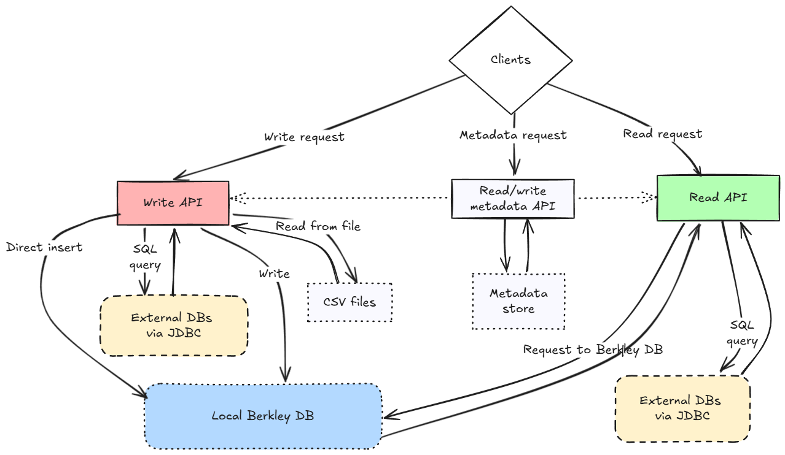
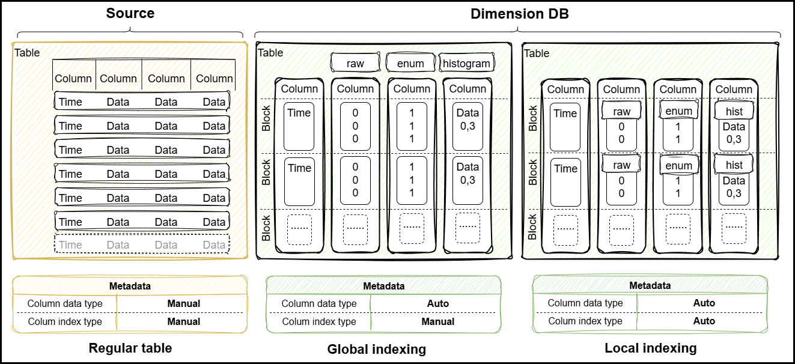

# Dimension DB


Hybrid time-series and block-column storage database engine written in Java

## Contents

- [Program Description](#program-description)
  - [General Information](#general-information)
  - [Application Areas](#application-areas)
  - [Minimum Technical Requirements](#minimum-technical-requirements)
  - [Getting Started with the Project](#getting-started-with-the-project)
    - [Building the Project](#building-the-project)
    - [Using the Project](#using-the-project)
    - [Prepare the environment to run unit tests](#prepare-the-environment-to-run-unit-tests)
    - [Prepare the environment to run integration tests](#prepare-the-environment-to-run-integration-tests)
      - [PostgreSQL](#postgresql)
      - [Oracle](#oracle)
      - [MS SQL](#ms-sql)
      - [Clickhouse](#clickhouse)
      - [Loading test data into Clickhouse](#loading-test-data-into-clickhouse)
  - [Description of the logical structure](#description-of-the-logical-structure)
  - [DB architecture](#db-architecture)
    - [Data storage format](#data-storage-format)
  - [Algorithms](#algorithms)
    - [DB initialization algorithm](#db-initialization-algorithm)
  - [Program API](#program-api)
    - [API sequence diagram](#api-sequence-diagram)
    - [Used methods](#used-methods)
      - [DStore interface](#dstore-interface)
      - [Dimension DB class](#dimension-db-class)
      - [Parameters](#parameters)
        - [Table type - enum TType](#table-type---enum-ttype)
        - [Table indexing type - enum IType](#table-indexing-type---enum-itype)
        - [Data analysis method type by table - enum AType](#data-analysis-method-type-by-table---enum-atype)
        - [Table backend type - enum BType](#table-backend-type---enum-btype)
        - [Data grouping function type - enum GroupFunction](#data-grouping-function-type---enum-groupfunction)
        - [Table column storage parameters - CSType class](#table-column-storage-parameters---cstype-class)
          - [Data storage type - enum SType](#data-storage-type---enum-stype)
          - [Java data storage type - enum CType](#java-data-storage-type---enum-ctype)
          - [JDBC/CSV data storage type - enum DataType](#jdbccsv-data-storage-type---enum-datatype)
      - [Input parameters](#input-parameters)
        - [DB settings](#db-settings---dbconfig-class)
        - [SProfile table settings](#sprofile-table-settings)
      - [Output parameters](#output-parameters)
        - [Table settings - TProfile class](#table-settings---tprofile-class)
        - [Table column settings - CProfile class](#table-column-settings---cprofile-class)
        - [Object to get data aggregates from stacked API - StackedColumn class](#object-to-get-data-aggregates-from-stacked-api---stackedcolumn-class)
          [Object to get data aggregates from the gantt API - GanttColumnCount and GanttColumnSum classes](#object-to-get-data-aggregates-from-the-gantt-api---ganttcolumncount-and-ganttcolumnsum-classes)
    - [Code use cases](#code-use-cases)
    - [Performance](#performance)
- [Download](#download)
- [Development](#development)
- [Documentation](#documentation)
- [License](#license)
- [Support](#support)
- [Contact](#contact)

## Program Description

### General Information
Dimension DB is a hybrid columnar database for storing time series data. Written in the Java programming language.

Key Features:
- Columnar data storage format;
- Storage of time series data;
- Storage format with built-in support for data deduplication and compression;
- Setting the storage format at the table and block level;
- Automatic selection of the deduplication algorithm based on the collected data;
- Use of the Berkley DB database as a backend for local storage;
- Support for basic JDBC data types for PostgreSQL, Oracle, MS SQL and ClickHouse databases;
- In read-only mode, automatic generation of SQL queries to tables with time series data;

[Return to Contents](#contents)

### Application areas
The library can be used as a lightweight analytical database for backend data processing systems on the Java platform to solve the following application problems;
- storing collected data and analytical processing of small and medium amounts of data for various embedded Java applications;
- storing and processing Internet of Things (IoT) data on the devices themselves as temporary storage, cache, and other tasks related to local data processing;
- metadata storage for querying external data sources using automatic SQL generation based on the data model for analytical applications.

[Return to Contents](#contents)

## Minimum technical requirements
**Dimension DB** is compatible with Java 21+ and comes with a small set of dependencies.

### Hardware requirements

Table 1. Hardware requirements

| Parameter        | Description                                                                                                                        |
|:-----------------|:-----------------------------------------------------------------------------------------------------------------------------------|
| CPU and RAM      | Processor with a frequency of at least 500 MHz and a memory capacity of at least 250 MB, depending on the volume of processed data |
| CPU architecture | Intel 64-bit (x86_64), AMD 64-bit (x86_64), Arm 64-bit (aarch64)                                                                   |
| Disk             | Disk size depending on the volume of processed data                                                                                |

### Software requirements

Table 2. Software requirements

| Software | Requirements             |
|:---------|:-------------------------|
| Java     | Java version 21+         |
| Maven    | Not lower than version 3 |
| Git      | Latest current version   |

### Operating system requirements

Table 3. Operating system requirements

| Software         | Requirements          |
|:-----------------|:----------------------|
| Operating system | Windows, Linux, MacOS |

[Return to Contents](#contents)

### Getting started with the project

#### Building the project
Make sure you have JDK 21+, Maven and the latest Git
  ```shell
    java -version
    mvn -version
    git --version
  ```

Download the Dimension DB repository sources:
  ```shell
    git clone <<url>>
    cd Dimension DB
  ```

To compile the project sources, run:
  ```shell
    mvn clean compile
  ```

To run unit tests, run:
  ```shell
    mvn clean test
  ```

To build the project into a **Dimension DB** jar file, run:
  ```shell
    mvn clean package
  ```

To build and install the **Dimension DB** jar file into your local Maven repository, run:
  ```shell
    mvn clean install
  ```

Notes:
- Running project build includes execution of unit tests, which take about 7-8 minutes.
- This is mainly the execution time of tests from the **Dimension DBRunnerTest** class, in which various configurations for 45 tests are launched.
- Information on tests from **Dimension DBRunnerTest** is presented in the table:

Table 4. Parameters and statistics for **Dimension DBRunnerTest** tests

| Test name              | PermutationState | Number of configurations | Total tests | Execution time |
|------------------------|------------------|--------------------------|-------------|----------------|
| testPermutationNone    | NONE             | 108                      | 4 860       | ~ 9 seconds    |
| testPermutationPartial | PARTIAL          | 1 944                    | 87 480      | ~ 2 minutes    |
| testPermutationAll     | ALL              | 26 244                   | 1 180 980   | ~ 25 minutes   |

- To reduce the time of building and installing the project, you can disable the launch of all tests from this class using the **-Dtest=!Dimension DBRunnerTest** switch or use the **@Disabled** annotation for a class or method
```shell
mvn clean test -Dtest=!DBaseRunnerTest
mvn clean package -Dtest=!DBaseRunnerTest
mvn clean install -Dtest=!DBaseRunnerTest
```

[Return to Contents](#contents)

#### Using the project
To use the **Dimension DB** database in a Java application, you need to add the jar file as a dependency to the Maven pom.xml settings file

Add the **Dimension DB** jar file as a dependency to your project's pom.xml settings file:
```xml
<?xml version="1.0" encoding="UTF-8"?>
<project>
  <properties>
    <dimension-db-version>25.7.1</dimension-db-version>
  </properties>
  <!--.....-->
  <!--.....-->
  <!--.....-->
  <dependencies>
    <dependency>
      <groupId>ru.dimension</groupId>
      <artifactId>db</artifactId>
      <version>{Dimension DB-version}</version>
    </dependency>
  </dependencies>
</project>
```

Notes:
- To build and install the latest current version of the **Dimension DB** library in the local Maven repository, download the application source codes and run:
```shell
mvn clean install
```
Details on building and installing the project are described in the [Building the project](#building-the-project) section
- You can find a full list of Dimension DB use cases in your application in the [Code use cases](#code-use-cases) section.

[Return to Contents](#contents)

#### Prepare the environment to run unit tests
To run unit tests, you need to follow the steps to build the project from the [Building the project](#building-the-project) section

[Return to Contents](#contents)

#### Prepare the environment to run integration tests
Preparing the environment to run integration tests requires a local database installation using Docker Desktop

Instructions for installing Docker Desktop for [Windows](https://docs.docker.com/desktop/install/windows-install/) and [Linux](https://docs.docker.com/desktop/install/linux/)

[Return to Contents](#contents)

##### PostgreSQL
Install and run a container with PostgreSQL DB
  ```shell
  docker run -d --name db \
  -e 'POSTGRES_PASSWORD=postgres' \
  -p 5432:5432 \
  -v pgdata:/var/lib/postgresql/data \
  postgres \
  postgres -c 'max_connections=200'
  ```

[Return to Contents](#contents)

##### Oracle
- Install locally [repository](https://github.com/oracle/docker-images) of scripts for installing Oracle DB
- Download the DB distribution from the [Oracle](https://www.oracle.com/database/technologies/oracle19c-linux-downloads.html) website. For the Linux x86 platform and DB version 19.3, copy the LINUX.X64_193000_db_home.zip file to the local directory of the OracleDatabase/SingleInstance/dockerfiles/19.3.0 script repository
- Run the buildContainerImage.sh script from the script repository and specify the parameters (example for DB version 19.3.0)
  ```shell
  OracleDatabase/SingleInstance/dockerfiles/buildContainerImage.sh -v 19.3.0 -e -i
  ```
- Install and run a container with an Oracle DB instance from the command line (example of running the Docker run command for DB version 19.3.0)
  ```shell
  docker run --name database19ee \
  -p 1523:1521 -p 5522:5500 -e \
  ORACLE_SID=orcl -e ORACLE_PDB=pdb_orcl -e ORACLE_PWD=sys \
  -e ORACLE_CHARACTERSET=AL32UTF8 \
  -v /opt/oracle/oradata oracle/database:19.3.0-ee
  ```

[Return to Contents](#contents)

##### MS SQL
Install and run container with MS SQL DB
  ```shell
  docker run -e 'ACCEPT_EULA=Y' \
  -e 'SA_PASSWORD=QOEfSsa51234!' \
  -p 1433:1433 \
  -v |(pwd)/drive:/var/opt/mssql/data \
  --name mssql \
  mcr.microsoft.com/mssql/server
  ```

[Return to Contents](#contents)

##### Clickhouse
Install and run container with Clickhouse DB
  ```shell
  docker run -d --name clickhouse-server \
  -e CLICKHOUSE_USER=admin -e CLICKHOUSE_DEFAULT_ACCESS_MANAGEMENT=1 -e CLICKHOUSE_PASSWORD=admin \
  -p 8123:8123 -p 9000:9000 \
  -v C:\clickhouse:/var/lib/clickhouse clickhouse/clickhouse-server
  ```

[Return to Contents](#contents)

##### Loading test data into Clickhouse
- Install [Clickhouse](#clickhouse) locally and check the connection to ClickHouse on a local PC using the URL **"jdbc:clickhouse://localhost:8123"** or use another connection string and make changes to the tests;
- Load test data [New York taxi orders](https://clickhouse.com/docs/en/getting-started/example-datasets/nyc-taxi#download-of-prepared-partitions) into a local ClickHouse instance (the format of pre-prepared partitions loaded into the datasets schema is used);
- Check that the data has loaded `clickhouse-client --query "select count(*) from datasets.trips_mergetree"`;
- Create a directory for local storage of **Dimension DB** data (example for Windows) **"C:\\Users\\.temp"**;
- Load test data into the local **Dimension DB** database using any of the methods in **Dimension DBCHLoadDataTest** marked with the @Test annotation;
– Run integration tests in **Dimension DBCHQueryGanttTest**, **Dimension DBCHQueryStackedTest** or **Dimension DBCHQueryRawTest** which are marked with the @Test annotation.

Notes:
- Integration tests use the **@Disabled** annotation to disable them when running Dimension DB unit tests, if necessary, it should be removed for correct data loading and testing.
- Test data from the trips_mergetree table is loaded into the datasets schema
  ```
  CREATE DATABASE datasets;
  ```
- Trips_mergetree table definition

<details>
  <summary>CREATE TABLE trips_mergetree</summary>

```
    CREATE TABLE trips_mergetree (
      trip_id UInt32,
      vendor_id Enum8('1' = 1, '2' = 2, 'CMT' = 3, 'VTS' = 4, 'DDS' = 5, 'B02512' = 10, 'B02598' = 11, 'B02617' = 12, 'B02682' = 13, 'B02764' = 14),
      pickup_date Date,
      pickup_datetime DateTime,
      dropoff_date Date,
      dropoff_datetime DateTime,
      store_and_fwd_flag UInt8,
      rate_code_id UInt8,
      pickup_longitude Float64,
      pickup_latitude Float64,
      dropoff_longitude Float64,
      dropoff_latitude Float64,
      passenger_count UInt8,
      trip_distance Float64,
      fare_amount Float32,
      extra Float32,
      mta_tax Float32,
      tip_amount Float32,
      tolls_amount Float32,
      ehail_fee Float32,
      improvement_surcharge Float32,
      total_amount Float32,
      payment_type_ Enum8('UNK' = 0, 'CSH' = 1, 'CRE' = 2, 'NOC' = 3, 'DIS' = 4),
      trip_type UInt8,
      pickup FixedString(25),
      dropoff FixedString(25),
      cab_type Enum8('yellow' = 1, 'green' = 2, 'uber' = 3),
      pickup_nyct2010_gid UInt8,
      pickup_ctlabel Float32,
      pickup_borocode UInt8,
      pickup_boroname Enum8('' = 0, 'Manhattan' = 1, 'Bronx' = 2, 'Brooklyn' = 3, 'Queens' = 4, 'Staten Island' = 5),
      pickup_ct2010 FixedString(6),
      pickup_boroct2010 FixedString(7),
      pickup_cdeligibil Enum8(' ' = 0, 'E' = 1, 'I' = 2),
      pickup_ntacode FixedString(4),
      pickup_ntaname Enum16('' = 0, 'Airport' = 1, 'Allerton-Pelham Gardens' = 2, 'Annadale-Huguenot-Prince\'s Bay-Eltingville' = 3, 'Arden Heights' = 4, 'Astoria' = 5, 'Auburndale' = 6, 'Baisley Park' = 7, 'Bath Beach' = 8, 'Battery Park City-Lower Manhattan' = 9, 'Bay Ridge' = 10, 'Bayside-Bayside Hills' = 11, 'Bedford' = 12, 'Bedford Park-Fordham North' = 13, 'Bellerose' = 14, 'Belmont' = 15, 'Bensonhurst East' = 16, 'Bensonhurst West' = 17, 'Borough Park' = 18, 'Breezy Point-Belle Harbor-Rockaway Park-Broad Channel' = 19, 'Briarwood-Jamaica Hills' = 20, 'Brighton Beach' = 21, 'Bronxdale' = 22, 'Brooklyn Heights-Cobble Hill' = 23, 'Brownsville' = 24, 'Bushwick North' = 25, 'Bushwick South' = 26, 'Cambria Heights' = 27, 'Canarsie' = 28, 'Carroll Gardens-Columbia Street-Red Hook' = 29, 'Central Harlem North-Polo Grounds' = 30, 'Central Harlem South' = 31, 'Charleston-Richmond Valley-Tottenville' = 32, 'Chinatown' = 33, 'Claremont-Bathgate' = 34, 'Clinton' = 35, 'Clinton Hill' = 36, 'Co-op City' = 37, 'College Point' = 38, 'Corona' = 39, 'Crotona Park East' = 40, 'Crown Heights North' = 41, 'Crown Heights South' = 42, 'Cypress Hills-City Line' = 43, 'DUMBO-Vinegar Hill-Downtown Brooklyn-Boerum Hill' = 44, 'Douglas Manor-Douglaston-Little Neck' = 45, 'Dyker Heights' = 46, 'East Concourse-Concourse Village' = 47, 'East Elmhurst' = 48, 'East Flatbush-Farragut' = 49, 'East Flushing' = 50, 'East Harlem North' = 51, 'East Harlem South' = 52, 'East New York' = 53, 'East New York (Pennsylvania Ave)' = 54, 'East Tremont' = 55, 'East Village' = 56, 'East Williamsburg' = 57, 'Eastchester-Edenwald-Baychester' = 58, 'Elmhurst' = 59, 'Elmhurst-Maspeth' = 60, 'Erasmus' = 61, 'Far Rockaway-Bayswater' = 62, 'Flatbush' = 63, 'Flatlands' = 64, 'Flushing' = 65, 'Fordham South' = 66, 'Forest Hills' = 67, 'Fort Greene' = 68, 'Fresh Meadows-Utopia' = 69, 'Ft. Totten-Bay Terrace-Clearview' = 70, 'Georgetown-Marine Park-Bergen Beach-Mill Basin' = 71, 'Glen Oaks-Floral Park-New Hyde Park' = 72, 'Glendale' = 73, 'Gramercy' = 74, 'Grasmere-Arrochar-Ft. Wadsworth' = 75, 'Gravesend' = 76, 'Great Kills' = 77, 'Greenpoint' = 78, 'Grymes Hill-Clifton-Fox Hills' = 79, 'Hamilton Heights' = 80, 'Hammels-Arverne-Edgemere' = 81, 'Highbridge' = 82, 'Hollis' = 83, 'Homecrest' = 84, 'Hudson Yards-Chelsea-Flatiron-Union Square' = 85, 'Hunters Point-Sunnyside-West Maspeth' = 86, 'Hunts Point' = 87, 'Jackson Heights' = 88, 'Jamaica' = 89, 'Jamaica Estates-Holliswood' = 90, 'Kensington-Ocean Parkway' = 91, 'Kew Gardens' = 92, 'Kew Gardens Hills' = 93, 'Kingsbridge Heights' = 94, 'Laurelton' = 95, 'Lenox Hill-Roosevelt Island' = 96, 'Lincoln Square' = 97, 'Lindenwood-Howard Beach' = 98, 'Longwood' = 99, 'Lower East Side' = 100, 'Madison' = 101, 'Manhattanville' = 102, 'Marble Hill-Inwood' = 103, 'Mariner\'s Harbor-Arlington-Port Ivory-Graniteville' = 104, 'Maspeth' = 105, 'Melrose South-Mott Haven North' = 106, 'Middle Village' = 107, 'Midtown-Midtown South' = 108, 'Midwood' = 109, 'Morningside Heights' = 110, 'Morrisania-Melrose' = 111, 'Mott Haven-Port Morris' = 112, 'Mount Hope' = 113, 'Murray Hill' = 114, 'Murray Hill-Kips Bay' = 115, 'New Brighton-Silver Lake' = 116, 'New Dorp-Midland Beach' = 117, 'New Springville-Bloomfield-Travis' = 118, 'North Corona' = 119, 'North Riverdale-Fieldston-Riverdale' = 120, 'North Side-South Side' = 121, 'Norwood' = 122, 'Oakland Gardens' = 123, 'Oakwood-Oakwood Beach' = 124, 'Ocean Hill' = 125, 'Ocean Parkway South' = 126, 'Old Astoria' = 127, 'Old Town-Dongan Hills-South Beach' = 128, 'Ozone Park' = 129, 'Park Slope-Gowanus' = 130, 'Parkchester' = 131, 'Pelham Bay-Country Club-City Island' = 132, 'Pelham Parkway' = 133, 'Pomonok-Flushing Heights-Hillcrest' = 134, 'Port Richmond' = 135, 'Prospect Heights' = 136, 'Prospect Lefferts Gardens-Wingate' = 137, 'Queens Village' = 138, 'Queensboro Hill' = 139, 'Queensbridge-Ravenswood-Long Island City' = 140, 'Rego Park' = 141, 'Richmond Hill' = 142, 'Ridgewood' = 143, 'Rikers Island' = 144, 'Rosedale' = 145, 'Rossville-Woodrow' = 146, 'Rugby-Remsen Village' = 147, 'Schuylerville-Throgs Neck-Edgewater Park' = 148, 'Seagate-Coney Island' = 149, 'Sheepshead Bay-Gerritsen Beach-Manhattan Beach' = 150, 'SoHo-TriBeCa-Civic Center-Little Italy' = 151, 'Soundview-Bruckner' = 152, 'Soundview-Castle Hill-Clason Point-Harding Park' = 153, 'South Jamaica' = 154, 'South Ozone Park' = 155, 'Springfield Gardens North' = 156, 'Springfield Gardens South-Brookville' = 157, 'Spuyten Duyvil-Kingsbridge' = 158, 'St. Albans' = 159, 'Stapleton-Rosebank' = 160, 'Starrett City' = 161, 'Steinway' = 162, 'Stuyvesant Heights' = 163, 'Stuyvesant Town-Cooper Village' = 164, 'Sunset Park East' = 165, 'Sunset Park West' = 166, 'Todt Hill-Emerson Hill-Heartland Village-Lighthouse Hill' = 167, 'Turtle Bay-East Midtown' = 168, 'University Heights-Morris Heights' = 169, 'Upper East Side-Carnegie Hill' = 170, 'Upper West Side' = 171, 'Van Cortlandt Village' = 172, 'Van Nest-Morris Park-Westchester Square' = 173, 'Washington Heights North' = 174, 'Washington Heights South' = 175, 'West Brighton' = 176, 'West Concourse' = 177, 'West Farms-Bronx River' = 178, 'West New Brighton-New Brighton-St. George' = 179, 'West Village' = 180, 'Westchester-Unionport' = 181, 'Westerleigh' = 182, 'Whitestone' = 183, 'Williamsbridge-Olinville' = 184, 'Williamsburg' = 185, 'Windsor Terrace' = 186, 'Woodhaven' = 187, 'Woodlawn-Wakefield' = 188, 'Woodside' = 189, 'Yorkville' = 190, 'park-cemetery-etc-Bronx' = 191, 'park-cemetery-etc-Brooklyn' = 192, 'park-cemetery-etc-Manhattan' = 193, 'park-cemetery-etc-Queens' = 194, 'park-cemetery-etc-Staten Island' = 195),
      pickup_puma UInt16,
      dropoff_nyct2010_gid UInt8,
      dropoff_ctlabel Float32,
      dropoff_borocode UInt8,
      dropoff_boroname Enum8('' = 0, 'Manhattan' = 1, 'Bronx' = 2, 'Brooklyn' = 3, 'Queens' = 4, 'Staten Island' = 5),
      dropoff_ct2010 FixedString(6),
      dropoff_boroct2010 FixedString(7),
      dropoff_cdeligibil Enum8(' ' = 0, 'E' = 1, 'I' = 2),
      dropoff_ntacode FixedString(4),
      dropoff_ntaname Enum16('' = 0, 'Airport' = 1, 'Allerton-Pelham Gardens' = 2, 'Annadale-Huguenot-Prince\'s Bay-Eltingville' = 3, 'Arden Heights' = 4, 'Astoria' = 5, 'Auburndale' = 6, 'Baisley Park' = 7, 'Bath Beach' = 8, 'Battery Park City-Lower Manhattan' = 9, 'Bay Ridge' = 10, 'Bayside-Bayside Hills' = 11, 'Bedford' = 12, 'Bedford Park-Fordham North' = 13, 'Bellerose' = 14, 'Belmont' = 15, 'Bensonhurst East' = 16, 'Bensonhurst West' = 17, 'Borough Park' = 18, 'Breezy Point-Belle Harbor-Rockaway Park-Broad Channel' = 19, 'Briarwood-Jamaica Hills' = 20, 'Brighton Beach' = 21, 'Bronxdale' = 22, 'Brooklyn Heights-Cobble Hill' = 23, 'Brownsville' = 24, 'Bushwick North' = 25, 'Bushwick South' = 26, 'Cambria Heights' = 27, 'Canarsie' = 28, 'Carroll Gardens-Columbia Street-Red Hook' = 29, 'Central Harlem North-Polo Grounds' = 30, 'Central Harlem South' = 31, 'Charleston-Richmond Valley-Tottenville' = 32, 'Chinatown' = 33, 'Claremont-Bathgate' = 34, 'Clinton' = 35, 'Clinton Hill' = 36, 'Co-op City' = 37, 'College Point' = 38, 'Corona' = 39, 'Crotona Park East' = 40, 'Crown Heights North' = 41, 'Crown Heights South' = 42, 'Cypress Hills-City Line' = 43, 'DUMBO-Vinegar Hill-Downtown Brooklyn-Boerum Hill' = 44, 'Douglas Manor-Douglaston-Little Neck' = 45, 'Dyker Heights' = 46, 'East Concourse-Concourse Village' = 47, 'East Elmhurst' = 48, 'East Flatbush-Farragut' = 49, 'East Flushing' = 50, 'East Harlem North' = 51, 'East Harlem South' = 52, 'East New York' = 53, 'East New York (Pennsylvania Ave)' = 54, 'East Tremont' = 55, 'East Village' = 56, 'East Williamsburg' = 57, 'Eastchester-Edenwald-Baychester' = 58, 'Elmhurst' = 59, 'Elmhurst-Maspeth' = 60, 'Erasmus' = 61, 'Far Rockaway-Bayswater' = 62, 'Flatbush' = 63, 'Flatlands' = 64, 'Flushing' = 65, 'Fordham South' = 66, 'Forest Hills' = 67, 'Fort Greene' = 68, 'Fresh Meadows-Utopia' = 69, 'Ft. Totten-Bay Terrace-Clearview' = 70, 'Georgetown-Marine Park-Bergen Beach-Mill Basin' = 71, 'Glen Oaks-Floral Park-New Hyde Park' = 72, 'Glendale' = 73, 'Gramercy' = 74, 'Grasmere-Arrochar-Ft. Wadsworth' = 75, 'Gravesend' = 76, 'Great Kills' = 77, 'Greenpoint' = 78, 'Grymes Hill-Clifton-Fox Hills' = 79, 'Hamilton Heights' = 80, 'Hammels-Arverne-Edgemere' = 81, 'Highbridge' = 82, 'Hollis' = 83, 'Homecrest' = 84, 'Hudson Yards-Chelsea-Flatiron-Union Square' = 85, 'Hunters Point-Sunnyside-West Maspeth' = 86, 'Hunts Point' = 87, 'Jackson Heights' = 88, 'Jamaica' = 89, 'Jamaica Estates-Holliswood' = 90, 'Kensington-Ocean Parkway' = 91, 'Kew Gardens' = 92, 'Kew Gardens Hills' = 93, 'Kingsbridge Heights' = 94, 'Laurelton' = 95, 'Lenox Hill-Roosevelt Island' = 96, 'Lincoln Square' = 97, 'Lindenwood-Howard Beach' = 98, 'Longwood' = 99, 'Lower East Side' = 100, 'Madison' = 101, 'Manhattanville' = 102, 'Marble Hill-Inwood' = 103, 'Mariner\'s Harbor-Arlington-Port Ivory-Graniteville' = 104, 'Maspeth' = 105, 'Melrose South-Mott Haven North' = 106, 'Middle Village' = 107, 'Midtown-Midtown South' = 108, 'Midwood' = 109, 'Morningside Heights' = 110, 'Morrisania-Melrose' = 111, 'Mott Haven-Port Morris' = 112, 'Mount Hope' = 113, 'Murray Hill' = 114, 'Murray Hill-Kips Bay' = 115, 'New Brighton-Silver Lake' = 116, 'New Dorp-Midland Beach' = 117, 'New Springville-Bloomfield-Travis' = 118, 'North Corona' = 119, 'North Riverdale-Fieldston-Riverdale' = 120, 'North Side-South Side' = 121, 'Norwood' = 122, 'Oakland Gardens' = 123, 'Oakwood-Oakwood Beach' = 124, 'Ocean Hill' = 125, 'Ocean Parkway South' = 126, 'Old Astoria' = 127, 'Old Town-Dongan Hills-South Beach' = 128, 'Ozone Park' = 129, 'Park Slope-Gowanus' = 130, 'Parkchester' = 131, 'Pelham Bay-Country Club-City Island' = 132, 'Pelham Parkway' = 133, 'Pomonok-Flushing Heights-Hillcrest' = 134, 'Port Richmond' = 135, 'Prospect Heights' = 136, 'Prospect Lefferts Gardens-Wingate' = 137, 'Queens Village' = 138, 'Queensboro Hill' = 139, 'Queensbridge-Ravenswood-Long Island City' = 140, 'Rego Park' = 141, 'Richmond Hill' = 142, 'Ridgewood' = 143, 'Rikers Island' = 144, 'Rosedale' = 145, 'Rossville-Woodrow' = 146, 'Rugby-Remsen Village' = 147, 'Schuylerville-Throgs Neck-Edgewater Park' = 148, 'Seagate-Coney Island' = 149, 'Sheepshead Bay-Gerritsen Beach-Manhattan Beach' = 150, 'SoHo-TriBeCa-Civic Center-Little Italy' = 151, 'Soundview-Bruckner' = 152, 'Soundview-Castle Hill-Clason Point-Harding Park' = 153, 'South Jamaica' = 154, 'South Ozone Park' = 155, 'Springfield Gardens North' = 156, 'Springfield Gardens South-Brookville' = 157, 'Spuyten Duyvil-Kingsbridge' = 158, 'St. Albans' = 159, 'Stapleton-Rosebank' = 160, 'Starrett City' = 161, 'Steinway' = 162, 'Stuyvesant Heights' = 163, 'Stuyvesant Town-Cooper Village' = 164, 'Sunset Park East' = 165, 'Sunset Park West' = 166, 'Todt Hill-Emerson Hill-Heartland Village-Lighthouse Hill' = 167, 'Turtle Bay-East Midtown' = 168, 'University Heights-Morris Heights' = 169, 'Upper East Side-Carnegie Hill' = 170, 'Upper West Side' = 171, 'Van Cortlandt Village' = 172, 'Van Nest-Morris Park-Westchester Square' = 173, 'Washington Heights North' = 174, 'Washington Heights South' = 175, 'West Brighton' = 176, 'West Concourse' = 177, 'West Farms-Bronx River' = 178, 'West New Brighton-New Brighton-St. George' = 179, 'West Village' = 180, 'Westchester-Unionport' = 181, 'Westerleigh' = 182, 'Whitestone' = 183, 'Williamsbridge-Olinville' = 184, 'Williamsburg' = 185, 'Windsor Terrace' = 186, 'Woodhaven' = 187, 'Woodlawn-Wakefield' = 188, 'Woodside' = 189, 'Yorkville' = 190, 'park-cemetery-etc-Bronx' = 191, 'park-cemetery-etc-Brooklyn' = 192, 'park-cemetery-etc-Manhattan' = 193, 'park-cemetery-etc-Queens' = 194, 'park-cemetery-etc-Staten Island' = 195),
      dropoff_puma UInt16
    ) ENGINE = MergeTree() ORDER BY (pickup_date, pickup_datetime);
```
</details>

[Return to Contents](#contents)

### Description of the logical structure

#### DB architecture


<details>
  <summary>Mermaid flow chart</summary>


</details>

[Return to Contents](#contents)

##### Data storage format


Three data storage formats are supported:
- **RAW** - when data is stored as a key of the Java type **int** for string data and a suitable Java type for the rest (numeric, special, etc.);
- **ENUM** - when data is stored as a key of the Java type **byte** value;
- **HISTOGRAM** - when the start and end index of repeating data from the range and the value itself are stored.

Metadata of the storage format, indexing type and compression are stored in the block header.

[Return to Contents](#contents)

#### Algorithms
The main methods of the Dimension DB Java API are located in the **DStore** interface.
Access to **DStore** must be obtained after initialization of the Dimension DB by calling the constructor of the **Dimension DB** class, examples are presented in the [DB initialization algorithm](#DB-initialization-algorithm) section.

A complete list of methods of the main classes and interfaces with input and output parameters is posted in the [Used methods](#used-methods) section.

##### DB initialization algorithm
1. Define a local directory for storing Dimension DB settings;
2. Create the Dimension DB DB configuration **Dimension DBConfig**;
3. Initialize the backend DB;
4. Initialize the Dimension DB by calling the constructor from the **Dimension DB** class;
5. Get a reference to the **DStore** interface from the **Dimension DB** class to access the Dimension DB Java API.

Example of DB initialization for Berkley DB backend
```
@TempDir
static File databaseDir;
...
Dimension DBConfig Dimension DBConfig = new Dimension DBConfig().setConfigDirectory(databaseDir.getAbsolutePath());
BerkleyDB berkleyDB = new BerkleyDB(databaseDir.getAbsolutePath(), true);
Dimension DB Dimension DB = new Dimension DB(Dimension DBConfig, berkleyDB.getStore());
DStore fStore = Dimension DB.getDStore();
```

Example of DB initialization for ClickHouse backend 
```
@TempDir
static File databaseDir;
...
BType bType = BType.CLICKHOUSE;
String driverClassName = "com.clickhouse.jdbc.ClickHouseDriver";
String dbUrl = "jdbc:clickhouse://localhost:8123";

SqlDB sqlDB = new SqlDB(bType, driverClassName, dbUrl, "admin", "admin");
BasicDataSource basicDataSource = sqlDB.getDatasource();
Dimension DBConfig Dimension DBConfig = new Dimension DBConfig().setConfigDirectory(databaseDir.getAbsolutePath());

Dimension DB Dimension DB = new Dimension DB(Dimension DBConfig, bType, basicDataSource);
DStore fStore = Dimension DB.getDStore();
```

Notes:
- The temporary directory **databaseDir** is created automatically using the **@TempDir** annotation of the JUnit library;
- For the example with the Berkley DB backend, Dimension DB settings and backend data are located in the same temporary directory **databaseDir**;
- Code examples are taken from unit and integration tests.

[Return to Contents](#contents)

#### Program API

**Dimension DB** offers advanced capabilities for interacting with the database through a set of methods capable of performing various data storage and retrieval tasks. These APIs are specifically designed to provide flexibility and optimal work with time series data in a Java environment for both locally stored data and external data storage systems with an SQL interface.

- **Main API**. The main functions for working with data are built into the **DStore** interface, which provides standardized access to write and read methods. **DStore** is a key element of the **Dimension DB** architecture, providing an interface point for interacting with the database for client applications.

- **Writing data**. Several approaches are supported for writing information to the Dimension DB database:

  - **Direct** - inserting data into a local database using an intermediate Java table-type data structure.
  - **JDBC** — insert data into a local database using data received from an external data source via JDBC, which allows integration with other systems that can work with JDBC.
  - **JDBC Batch** — batch loading into a local database using data received from an external data source via JDBC, minimizing the number of transactions for large-scale insertion.
  - **CSV Batch** — batch loading from CSV files, for transferring large amounts of data from files to a local database (experimental).

- **Reading data**. The process of extracting data from **Dimension DB** uses APIs, each of which is optimized for the corresponding types of queries:

  - **Stacked** — retrieving data based on aggregation functions such as COUNT SUM and AVG, obtaining information on the distribution of data by selected attributes and parameters.
  - **Gantt** — complex distribution calculation using COUNT aggregation at two levels, which is useful for analyzing dependencies and relationships between different indicators.
  - **Raw** — extracting source data in tabular format to view detailed information on the entire array of collected data.
  - **BatchResultSet** — extracting source data in tabular format with row-by-row access to get only part of the rows from the result set in the DB.

- **Loading metadata**. To work with external data sources, you need to perform queries to sources via JDBC, CSV files and Java table structures. To store information on tables and data types used for local storage and access to external data sources via JDBC, an API is used to load and view this information in a local Dimension DB metadata storage file.

The APIs for writing data only work with the local Berkley DB key-value data storage. API methods for reading data can work with both local Berkley DB storage and external data sources via JDBC using automatic generation of SQL queries.

Table 5. Supported databases for working with API in Dimension DB

| № | Dimension DB API support | Database             | Database type |
|---|--------------------------|----------------------|---------------|
| 1 | Read/Write               | Berkley DB           | key-value     |
| 2 | Read                     | ClickHouse           | analytical    |
| 3 | Read                     | Oracle               | relational    |
| 4 | Read                     | PostgreSQL           | relational    |
| 5 | Read                     | Microsoft SQL Server | relational    |
| 6 | Read                     | MySQL                | relational    |
| 7 | Read                     | CSV files            | file          |

Before you start writing data, you need to set storage parameters and metadata for tables and columns in the **SProfile** object.

The database table configuration allows you to switch between global and local indexing, and enable or disable data compression on the fly. This is achieved by placing storage type metadata in the block header for both indexing types and a flag to enable or disable compression.

[Return to Contents](#contents)

##### API Sequence Diagram


<details>
  <summary>Mermaid sequence diagram</summary>


</details>

[Return to Contents](#contents)

##### Used methods
- The **DStore** interface contains the main contracts and method signatures for interaction between the **Dimension DB** database and client applications;
- Initialization of database objects occurs when calling the **Dimension DB** class constructor;
- The reference to the **DStore** interface for accessing the application API is called from the **Dimension DB** class object.

###### DStore interface

Table 6. List of APIs for working with the Dimension DB database of the DStore interface

| #  | Method Name             | API Type | Description                                  | Input Parameters                                                                                                                                                      | Output Parameters         |
|----|-------------------------|----------|----------------------------------------------|-----------------------------------------------------------------------------------------------------------------------------------------------------------------------|---------------------------|
| 1  | getTProfile             | Metadata | Get table metadata by name                   | String tableName                                                                                                                                                      | TProfile                  |
| 2  | loadDirectTableMetadata | Metadata | Load metadata from SProfile                  | SProfile sProfile                                                                                                                                                     | TProfile                  |
| 3  | loadJdbcTableMetadata   | Metadata | Load metadata via JDBC connection with query | Connection connection, String query, SProfile sProfile                                                                                                                | TProfile                  |
| 4  | loadJdbcTableMetadata   | Metadata | Load metadata via JDBC (schema and table)    | Connection connection, String sqlSchemaName, String sqlTableName, SProfile sProfile                                                                                   | TProfile                  |
| 5  | loadCsvTableMetadata    | Metadata | Load metadata from CSV file                  | String fileName, String csvSplitBy, SProfile sProfile                                                                                                                 | TProfile                  |
| 6  | setTimestampColumn      | Metadata | Set timestamp column                         | String tableName, String timestampColumnName                                                                                                                          | void                      |
| 7  | putDataDirect           | Write    | Save data using Java structure               | String tableName, List<List<Object>> data                                                                                                                             | void                      |
| 8  | putDataJdbc             | Write    | Save data from JDBC ResultSet                | String tableName, ResultSet resultSet                                                                                                                                 | long (last row timestamp) |
| 9  | putDataJdbcBatch        | Write    | Batch save from JDBC ResultSet               | String tableName, ResultSet resultSet, Integer Dimension DBBatchSize                                                                                                  | void                      |
| 10 | putDataCsvBatch         | Write    | Batch save from CSV file                     | String tableName, String fileName, String csvSplitBy, Integer Dimension DBBatchSize                                                                                   | void                      |
| 11 | getBlockKeyTailList     | Read     | Get blocks with keys and ranges              | String tableName, long begin, long end                                                                                                                                | List<BlockKeyTail>        |
| 12 | getStacked              | Read     | Get aggregated data (COUNT/SUM/AVG)          | String tableName, CProfile cProfile, GroupFunction groupFunction, long begin, long end                                                                                | List<StackedColumn>       |
| 13 | getStacked              | Read     | Get aggregated data with filter              | String tableName, CProfile cProfile, GroupFunction groupFunction, CProfile cProfileFilter, String[] filterData, CompareFunction compareFunction, long begin, long end | List<StackedColumn>       |
| 14 | getGantt                | Read     | Two-level COUNT grouping (basic)             | String tableName, CProfile firstGrpBy, CProfile secondGrpBy, long begin, long end                                                                                     | List<GanttColumnCount>    |
| 15 | getGantt                | Read     | Two-level COUNT grouping (multithreaded)     | String tableName, CProfile firstGrpBy, CProfile secondGrpBy, int batchSize, long begin, long end                                                                      | List<GanttColumnCount>    |
| 16 | getGantt                | Read     | Two-level COUNT grouping with filter         | String tableName, CProfile firstGrpBy, CProfile secondGrpBy, CProfile cProfileFilter, String[] filterData, CompareFunction compareFunction, long begin, long end      | List<GanttColumnCount>    |
| 17 | getGanttSum             | Read     | Two-level SUM grouping (basic)               | String tableName, CProfile firstGrpBy, CProfile secondGrpBy, long begin, long end                                                                                     | List<GanttColumnSum>      |
| 18 | getGanttSum             | Read     | Two-level SUM grouping with filter           | String tableName, CProfile firstGrpBy, CProfile secondGrpBy, CProfile cProfileFilter, String[] filterData, CompareFunction compareFunction, long begin, long end      | List<GanttColumnSum>      |
| 19 | getDistinct             | Read     | Get distinct values (basic)                  | String tableName, CProfile cProfile, OrderBy orderBy, int limit, long begin, long end                                                                                 | List<String>              |
| 20 | getDistinct             | Read     | Get distinct values with filter              | String tableName, CProfile cProfile, OrderBy orderBy, int limit, long begin, long end, CProfile cProfileFilter, String[] filterData, CompareFunction compareFunction  | List<String>              |
| 21 | getRawDataAll           | Read     | Get raw data (all columns, no filter)        | String tableName, long begin, long end                                                                                                                                | List<List<Object>>        |
| 22 | getRawDataAll           | Read     | Get raw data (all columns, with filter)      | String tableName, CProfile cProfileFilter, String filter, long begin, long end                                                                                        | List<List<Object>>        |
| 23 | getRawDataByColumn      | Read     | Get raw data for specific column             | String tableName, CProfile cProfile, long begin, long end                                                                                                             | List<List<Object>>        |
| 24 | getBatchResultSet       | Read     | Batch read (regular tables)                  | String tableName, int fetchSize                                                                                                                                       | BatchResultSet            |
| 25 | getBatchResultSet       | Read     | Batch read (time-series tables)              | String tableName, long begin, long end, int fetchSize                                                                                                                 | BatchResultSet            |
| 26 | getFirst                | Metadata | Get first timestamp                          | String tableName, long begin, long end                                                                                                                                | long                      |
| 27 | getLast                 | Metadata | Get last timestamp                           | String tableName, long begin, long end                                                                                                                                | long                      |
| 28 | syncBackendDb           | Backend  | Sync Berkley DB to disk                      | -                                                                                                                                                                     | void                      |
| 29 | closeBackendDb          | Backend  | Close Berkley DB                             | -                                                                                                                                                                     | void                      |

[Return to Contents](#contents)

###### Dimension DB class

Table 7. DBase class where DB objects are initialized

| Item # | Constructor name |  API type  | Description                                             | Input parameters                                                                                                                                                                                                   | Output parameters |
|:------:|:-----------------|:----------:|:--------------------------------------------------------|:-------------------------------------------------------------------------------------------------------------------------------------------------------------------------------------------------------------------|:------------------|
|   1    | DBase            | Read/Write | Create Dimension DB storage for Berkley DB backend      | Dimension DBConfig Dimension DBConfig - local Dimension DB storage configuration,<br> EntityStore - Berkley DB data storage                                                                                        | Constructor       |
|   2    | DBase            |    Read    | Create Dimension DB storage for a specific backend type | Dimension DBConfig Dimension DBConfig - Dimension DB local storage configuration,<br> BType backendType - backend type for reading,<br> BasicDataSource basicDataSource - Apache DBCP2 JDBC connection pool object | Constructor       |

[Return to Contents](#contents)

###### Parameters

###### Table type - enum TType

Table 8. Enum TType for storing supported table types

| Property name | Type  | Description                        |
|:--------------|:------|:-----------------------------------|
| REGULAR       | TType | Table for storing regular tables   |
| TIME_SERIES   | TType | Table for storing time series data |

[Return to Contents](#contents)

###### Table indexing type - enum IType

Table 9. Enum IType for storing table indexing type

| Property name | Type  | Description                                                                                                                            |
|---------------|-------|----------------------------------------------------------------------------------------------------------------------------------------|
| GLOBAL        | IType | The type of index used (RAW, HISTOGRAM, ENUM), defined by the user at the table level for each column in the SProfile input parameters |
| LOCAL         | IType | The type of index used (RAW, HISTOGRAM, ENUM), determined automatically by the system at the data block level for each table column    |

[Return to Contents](#contents)

###### Data analysis method type by table - enum AType

Table 10. Enum AType for storing the data analysis method for local indexing

| Имя свойства   | Тип   | Описание                                                                                                                                                                                      |
|----------------|-------|-----------------------------------------------------------------------------------------------------------------------------------------------------------------------------------------------|
| ON_LOAD        | AType | Data is analyzed upon initial retrieval, and the indexing type for each column in the table is determined based on this analysis                                                              |
| FULL_PASS_ONCE | AType | Data is analyzed upon initial retrieval, then on subsequent runs, each column of the table is sequentially analyzed once, <br/>and the indexing type is determined based on this information. |
| FULL_PASS_EACH | AType | Same as FULL_PASS_ONCE, except each column of the table is analyzed every time the data write API is called. <br/>Each API call analyzes one column, cycling through them in order.           |

[Return to Contents](#contents)

###### Table backend type - enum BType

Table 11. Enum BType for storing supported DB types used as a backend for the API for reading and writing data

| Property name | Type  | Description          |
|---------------|-------|----------------------|
| BERKLEYDB     | BType | BerkleyDB            |
| CLICKHOUSE    | BType | ClickHouse           |
| ORACLE        | BType | Oracle               |
| POSTGRES      | BType | PostgreSQL           |
| MSSQL         | BType | Microsoft SQL Server |

[Return to Contents](#contents)

###### Data grouping function type - enum GroupFunction

Table 12. Enum GroupFunction for passing the grouping function when calling Stacked API

| Property name | Type          | Description                                                                                   |
|---------------|---------------|-----------------------------------------------------------------------------------------------|
| COUNT         | GroupFunction | Calculating the number of occurrences of unique indicators in the data by the cProfile column |
| SUM           | GroupFunction | Calculating the sum in the data by the cProfile column                                        |
| AVG           | GroupFunction | Calculating the average value in the data by the cProfile column                              |

[Return to Contents](#contents)

###### Table column storage parameters - CSType class

Table 13. CSType class for storing storage parameters and data types of table columns

| Property name | Type     | Default value | Description                                                                                                 |
|---------------|----------|---------------|-------------------------------------------------------------------------------------------------------------|
| isTimeStamp   | boolean  | false         | Flag indicating the column that stores the timestamp                                                        |
| sType         | SType    | null          | Data storage type in the table (RAW, HISTOGRAM, ENUM)                                                       |
| cType         | CType    | null          | Java data type used to store data in Berkley DB (Int, Long, Double, String ... etc.)                        |
| dType         | DataType | null          | JDBC/CSV data type used to convert data to Berkley DB Java type (INTEGER, DATE, DATETIME, VARCHAR ... etc.) |

[Return to Contents](#contents)

###### Data storage type - enum SType

Table 14. SType class for storing the table data storage type used in a column or block

| Property name | Type  | Default value | Description                                  |
|---------------|-------|---------------|----------------------------------------------|
| RAW           | SType | 1             | Data as is or as a key for string data types |
| HISTOGRAM     | SType | 2             | Data as a histogram                          |
| ENUM          | SType | 3             | Data as a list of constants                  |

[Return to Contents](#contents)

###### Java data storage type - enum CType

Table 15. CType class for storing the Java data type used to store data in the Berkley DB table column

| Property name | Type | Default Value | Description                         |
|---------------|------|---------------|-------------------------------------|
| BYTE          | int  | 1             | Represents a byte                   |
| INT           | int  | 2             | Represents an integer               |
| LONG          | int  | 3             | Represents a long integer           |
| FLOAT         | int  | 4             | Represents a float                  |
| DOUBLE        | int  | 5             | Represents a double-precision float |
| STRING        | int  | 6             | Represents a string                 |

[Return to Contents](#contents)

###### JDBC/CSV Data Storage Type - enum DataType

Table 16. DataType class for storing JDBC/CSV data types, which is used to convert data to Java storage format in Berkley DB database of Dimension DB database table column

| Property name | Type | Default value | Description                 |
|---------------|------|---------------|-----------------------------|
| BIT           | byte | 0             | Postgres: bit data type     |
| ...           | ...  | ...           | ...                         |
| RAW           | byte | 23            | Oracle: raw data            |
| ...           | ...  | ...           | ...                         |
| INT           | byte | 31            | MS SQL: integer             |
| ...           | ...  | ...           | ...                         |
| DEC           | byte | 47            | ClickHouse: Decimal Numbers |

[Full list of properties in file](src/main/java/ru/dimension/db/metadata/DataType.java)

[Return to Contents](#contents)

###### Input parameters

###### DB settings - DBConfig class

Table 17. Dimension DBaseConfig class for storing settings

| Property name   | Type   | Default value   | Description                                                                                  |
|-----------------|--------|-----------------|----------------------------------------------------------------------------------------------|
| configDirectory | String |                 | Absolute path to the directory for storing the configuration file with Dimension DB metadata |
| configFileName  | String | "metamodel.obj" | Name of the configuration file with Dimension DB metadata                                    |

[Return to Contents](#contents)

###### SProfile table settings

Table 18. SProfile class for storing table/column settings in the Dimension DB database (used in input parameters)

| Property name | Type                | Default value | Description                                         |
|---------------|---------------------|---------------|-----------------------------------------------------|
| tableName     | String              | null          | Table name                                          |
| tableType     | TType               | TIME_SERIES   | Table type                                          |
| indexType     | IType               | GLOBAL        | Index type                                          |
| backendType   | BType               | BERKLEYDB     | Backend type for storing data                       |
| compression   | Boolean             | FALSE         | Whether to use data compression in the table or not |
| csTypeMap     | Map<String, CSType> | null          | Key-value structure mapping column names to CSTypes |

[Return to Contents](#contents)

###### Output Parameters

###### Table Settings - TProfile Class

Table 19. TProfile Class for Getting Table/Column Settings from Metadata (Used in Output Parameters)

| Property Name | Type           | Default Value      | Description                         |
|---------------|----------------|--------------------|-------------------------------------|
| tableName     | String         | null               | Table Name                          |
| tableType     | TType          | null               | Table Type                          |
| indexType     | IType          | null               | Index Type                          |
| backendType   | BType          | null               | Backend Type                        |
| compression   | Boolean        | false              | Whether data compression is enabled |
| cProfiles     | List<CProfile> | null or empty list | List of table column settings       |

[Return to Contents](#contents)

###### Table Column Settings - CProfile Class

Table 20. CProfile Class for Storing Table Column Settings

| Property Name  | Type   | Default Value | Description                                                              |
|----------------|--------|---------------|--------------------------------------------------------------------------|
| colId          | int    | 0             | Unique Identifier                                                        |
| colIdSql       | int    | 0             | Column Identifier in SQL                                                 |
| colName        | String | null          | Column Name                                                              |
| colDbTypeName  | String | null          | Data Type Name in DB                                                     |
| colSizeDisplay | int    | 0             | Size for display                                                         |
| colSizeSqlType | int    | 0             | SQL Type Size                                                            |
| csType         | CSType | null          | The CSType type stores the storage parameters and data types of a column |

[Return to Contents](#contents)

###### Object to get data aggregates from stacked API - StackedColumn class

Timestamps store the date in milliseconds that have passed since January 1, 1970 - [Unix-time](https://en.wikipedia.org/wiki/Unix_time)

Table 21. StackedColumn class for get data aggregates from stacked API

| Property name | Type                 | Default value | Description                                                                                                                                                                      |
|---------------|----------------------|---------------|----------------------------------------------------------------------------------------------------------------------------------------------------------------------------------|
| key           | long                 | N/A           | Object identifier - timestamp of the beginning of the range by which the values of the aggregates in keyCount, keySum, keyAvg are calculated                                     |
| tail          | long                 | 0             | End timestamp of the range over which the aggregate values in keyCount, keySum, keyAvg are calculated                                                                            |
| keyCount      | Map<String, Integer> | Empty map     | Key-value structure for storing the number of occurrences of each indicator in the cProfile table column data when calling the Stacked API (for numeric and symbolic data types) |
| keySum        | Map<String, Double>  | Empty map     | Key-value structure for storing the sum of values for each key (only for numeric data types)                                                                                     |
| keyAvg        | Map<String, Double>  | Empty map     | Key-value structure for storing the average value for each key (only for numeric data types)                                                                                     |

[Return to Contents](#contents)

###### Object to get data aggregates from the gantt API - GanttColumnCount and GanttColumnSum classes

Table 22a.  GanttColumnCount Class for Two-Level COUNT Aggregation Results

| Property name | Type                 | Default value | Description                                                                                                                                                                 |
|---------------|----------------------|---------------|-----------------------------------------------------------------------------------------------------------------------------------------------------------------------------|
| key           | String               | N/A           | Key, stores a unique metric in the firstGrpBy table column data when calling the Gantt API                                                                                  |
| gantt         | Map<String, Integer> | Empty map     | Key-value structure, for storing the number of occurrences of each unique value from secondGrpBy with the key filter by the data from firstGrpBy when calling the Gantt API |

Table 22b. GanttColumnSum Class for Two-Level SUM Aggregation Results

| Property name | Type   | Default value | Description                                                             |
|---------------|--------|---------------|-------------------------------------------------------------------------|
| key           | String | N/A           | The unique value from the first grouping level column                   |
| value         | Double | 0             | Total sum of all values from the second (numeric) column for this group |

[Return to Contents](#contents)

### Code use cases
- All code use cases make **Dimension DB** API calls through the **DStore** interface;
- A detailed description of the contracts and method signatures of the **DStore** interface are presented in the [Used Methods](#used-methods) section;
- Before each call to a method of the **DStore** interface, it is initialized according to the instructions in the [DB Initialization Algorithm](#db-initialization-algorithm) section;
- A test case has been developed for each use case in [Dimension DBUseCasesCodeTest](src/test/java/ru/dimension/db/DBaseUseCasesCodeTest.java).

Table 23. Use cases

| #  | Method Name             | API Type | Description                                  | Use cases                                                                                    |
|----|-------------------------|----------|----------------------------------------------|----------------------------------------------------------------------------------------------|
| 1  | getTProfile             | Metadata | Get table metadata by name                   | [getTProfile](src/test/java/ru/dimension/db/DBaseUseCasesCodeTest.java)                      |
| 2  | loadDirectTableMetadata | Metadata | Load metadata from SProfile                  | [loadDirectTableMetadata](src/test/java/ru/dimension/db/DBaseUseCasesCodeTest.java)          |
| 3  | loadJdbcTableMetadata   | Metadata | Load metadata via JDBC connection with query | [loadJdbcTableMetadata](src/test/java/ru/dimension/db/DBaseUseCasesCodeTest.java)            |
| 4  | loadJdbcTableMetadata   | Metadata | Load metadata via JDBC (schema and table)    |                                                                                              |
| 5  | loadCsvTableMetadata    | Metadata | Load metadata from CSV file                  | [loadCsvTableMetadata](src/test/java/ru/dimension/db/DBaseUseCasesCodeTest.java)             |
| 6  | setTimestampColumn      | Metadata | Set timestamp column                         | [setTimestampColumn](src/test/java/ru/dimension/db/DBaseUseCasesCodeTest.java)               |
| 7  | putDataDirect           | Write    | Save data using Java structure               | [putDataDirect](src/test/java/ru/dimension/db/DBaseUseCasesCodeTest.java)                    |
| 8  | putDataJdbc             | Write    | Save data from JDBC ResultSet                | [putDataJdbc](src/test/java/ru/dimension/db/DBaseUseCasesCodeTest.java)                      |
| 9  | putDataJdbcBatch        | Write    | Batch save from JDBC ResultSet               | [putDataJdbcBatch](src/test/java/ru/dimension/db/DBaseUseCasesCodeTest.java)                 |
| 10 | putDataCsvBatch         | Write    | Batch save from CSV file                     | [getBatchResultSetRegularTable](src/test/java/ru/dimension/db/DBaseUseCasesCodeTest.java)    |
| 11 | getBlockKeyTailList     | Read     | Get blocks with keys and ranges              | [getBlockKeyTailList](src/test/java/ru/dimension/db/DBaseUseCasesCodeTest.java)              |
| 12 | getStacked              | Read     | Get aggregated data (COUNT/SUM/AVG)          | [getStacked](src/test/java/ru/dimension/db/DBaseUseCasesCodeTest.java)                       |
| 13 | getStacked              | Read     | Get aggregated data with filter              | [getStackedCountFilter](src/test/java/ru/dimension/db/DBaseUseCasesCodeTest.java)            |
| 14 | getGantt                | Read     | Two-level COUNT grouping (basic)             | [getGantt](src/test/java/ru/dimension/db/DBaseUseCasesCodeTest.java)                         |
| 15 | getGantt                | Read     | Two-level COUNT grouping (multithreaded)     | [getGantt](src/test/java/ru/dimension/db/DBaseUseCasesCodeTest.java)                         |
| 16 | getGantt                | Read     | Two-level COUNT grouping with filter         | [getGanttFilter](src/test/java/ru/dimension/db/DBaseUseCasesCodeTest.java)                   |
| 17 | getGanttSum             | Read     | Two-level SUM grouping (basic)               | [getGanttSum](src/test/java/ru/dimension/db/DBaseUseCasesCodeTest.java)                      |
| 18 | getGanttSum             | Read     | Two-level SUM grouping with filter           | [getGanttSumFiltered](src/test/java/ru/dimension/db/DBaseUseCasesCodeTest.java)              |
| 19 | getDistinct             | Read     | Get distinct values (basic)                  | [getDistinct](src/test/java/ru/dimension/db/DBaseUseCasesCodeTest.java)                      |
| 20 | getDistinct             | Read     | Get distinct values with filter              | [getDistinctWithFilter](src/test/java/ru/dimension/db/DBaseUseCasesCodeTest.java)            |
| 21 | getRawDataAll           | Read     | Get raw data (all columns, no filter)        | [getRawDataAll](src/test/java/ru/dimension/db/DBaseUseCasesCodeTest.java)                    |
| 22 | getRawDataAll           | Read     | Get raw data (all columns, with filter)      | [getRawDataAllFilter](src/test/java/ru/dimension/db/DBaseUseCasesCodeTest.java)              |
| 23 | getRawDataByColumn      | Read     | Get raw data for specific column             | [getRawDataByColumn](src/test/java/ru/dimension/db/DBaseUseCasesCodeTest.java)               |
| 24 | getBatchResultSet       | Read     | Batch read (regular tables)                  | [getBatchResultSetRegularTable](src/test/java/ru/dimension/db/DBaseUseCasesCodeTest.java)    |
| 25 | getBatchResultSet       | Read     | Batch read (time-series tables)              | [getBatchResultSetTimeSeriesTable](src/test/java/ru/dimension/db/DBaseUseCasesCodeTest.java) |
| 26 | getFirst                | Metadata | Get first timestamp                          | [getFirst](src/test/java/ru/dimension/db/DBaseUseCasesCodeTest.java)                         |
| 27 | getLast                 | Metadata | Get last timestamp                           | [getLast](src/test/java/ru/dimension/db/DBaseUseCasesCodeTest.java)                          |
| 28 | syncBackendDb           | Backend  | Sync Berkley DB to disk                      |                                                                                              |
| 29 | closeBackendDb          | Backend  | Close Berkley DB                             |                                                                                              |

[Return to Contents](#contents)

### Performance

Table 24. Test environment

| Category      | Details                                                                                                                          |
|---------------|----------------------------------------------------------------------------------------------------------------------------------|
| **Processor** | AMD Ryzen 5 5600H with Radeon Graphics, 3301 Mhz, 6 Core(s), 12 Logical Processor(s)                                             |
| **RAM**       | 16.0 GB                                                                                                                          |
| **Disk**      | Generic Flash Disk USB Device<br>- SAMSUNG MZVL2512HCJQ-00B00 (476.94 GB)                                                        |
| **OS**        | Microsoft Windows 11                                                                                                             |
| **Test data** | [New York taxi orders](https://clickhouse.com/docs/en/getting-started/example-datasets/nyc-taxi#download-of-prepared-partitions) |

<details>
  <summary>SQL query to get statistics for partition 2016</summary>

```sql
WITH 
2016_parts AS (
    SELECT sum(bytes) AS bytes
    FROM system.parts
    WHERE table = 'trips_mergetree'
      AND database = 'datasets'
      AND active
      AND partition LIKE '2016%'
)
SELECT
    (SELECT count() FROM datasets.trips_mergetree WHERE toYear(pickup_datetime) = 2016) AS exact_row_count,
    formatReadableSize((SELECT bytes FROM 2016_parts)) AS total_size,
    formatReadableSize((SELECT bytes FROM 2016_parts) / exact_row_count) AS avg_row_size;
```

</details> 

Table 25. Data for 2016

| exact_row_count | total_size | avg_row_size |
|-----------------|------------|--------------|
| 78325655        | 6.88 GiB   | 94.37 B      |

Table 26. Load profiles

| # | TType       | IType  | AType          | Compression | Load (min) | Size (GB) |
|--:|-------------|--------|----------------|-------------|------------|-----------|
| 1 | TIME_SERIES | GLOBAL | ON_LOAD        | true        | 31,47      | 9,225     |
| 2 | TIME_SERIES | LOCAL  | ON_LOAD        | true        | 27,12      | 11,396    |
| 3 | TIME_SERIES | LOCAL  | FULL_PASS_ONCE | true        | 27,98      | 12,060    |
| 4 | TIME_SERIES | LOCAL  | FULL_PASS_EACH | true        | 26,82      | 11,604    |

Table 27. Performance tests for gantt API

| № | Test name        | ON_LOAD <br/>Execution time <br/>(single/2-thread) (sec) | ON_LOAD <br/>Execution time <br/>(single/2-thread) (sec) | PASS_ONCE <br/>Execution time <br/>(single/2-thread) (sec) | PASS_EACH <br/>Execution time <br/>(single/2-thread) (sec) |
|---|------------------|----------------------------------------------------------|----------------------------------------------------------|------------------------------------------------------------|------------------------------------------------------------|
| 1 | getGanttRawRaw   | 13,4 / 10,6                                              | 17,8 / 11,1                                              | 18,9 / 11,0                                                | 16,1 / 10,4                                                |
| 2 | getGanttEnumEnum | 4,4 / 2,3                                                | 11,9 / 8,3                                               | 11,5 / 7,7                                                 | 11,4 / 8,0                                                 |
| 3 | getGanttHistHist | 2,2 / 1,2                                                | 14,6 / 10,3                                              | 14,1 / 10,2                                                | 13,5 / 9,8                                                 |
| 4 | getGanttHistRaw  | 10,1 / 7,8                                               | 13,6 / 9,4                                               | 12,8 / 9,3                                                 | 12,2 / 9,1                                                 |
| 5 | getGanttHistEnum | 3,5 / 2,3                                                | 15,5 / 10,4                                              | 14,2 / 9,9                                                 | 14,1 / 10,0                                                |
| 6 | getGanttEnumRaw  | 9,4 / 7,1                                                | 18,3 / 11,8                                              | 15,5 / 11,1                                                | 15,4 / 11,5                                                |
| 7 | getGanttEnumHist | 4,2 / 2,6                                                | 16,9 / 12,5                                              | 16,5 / 12,2                                                | 16,4 / 12,3                                                |
| 8 | getGanttRawHist  | 11,0 / 8,1                                               | 16,3 / 11,9                                              | 15,9 / 11,4                                                | 15,7 / 13,2                                                |
| 9 | getGanttRawEnum  | 8,9 / 6,5                                                | 15,7 / 12,1                                              | 15,5 / 10,8                                                | 16,1 / 11,5                                                |

Table 28. Queries Table

| № | Test name        | SQL query                                                                                                                                                                       |
|---|------------------|---------------------------------------------------------------------------------------------------------------------------------------------------------------------------------|
| 1 | getGanttRawRaw   | `SELECT pickup_cdeligibil, vendor_id, COUNT(vendor_id) FROM datasets.trips_mergetree WHERE toYear(pickup_date) = 2016 GROUP BY pickup_cdeligibil, vendor_id;`                   |
| 2 | getGanttHistRaw  | `SELECT trip_type, vendor_id, COUNT(vendor_id) FROM datasets.trips_mergetree WHERE toYear(pickup_date) = 2016 GROUP BY trip_type, vendor_id;`                                   |
| 3 | getGanttRawEnum  | `SELECT pickup_cdeligibil, cab_type, COUNT(cab_type) FROM datasets.trips_mergetree WHERE toYear(pickup_date) = 2016 GROUP BY pickup_cdeligibil, cab_type;`                      |
| 4 | getGanttRawHist  | `SELECT pickup_cdeligibil, pickup_boroname, COUNT(pickup_boroname) FROM datasets.trips_mergetree WHERE toYear(pickup_date) = 2016 GROUP BY pickup_cdeligibil, pickup_boroname;` |
| 5 | getGanttEnumEnum | `SELECT dropoff_puma, dropoff_borocode, COUNT(dropoff_borocode) FROM datasets.trips_mergetree where toYear(pickup_date) = 2016 group by dropoff_puma, dropoff_borocode;`        |
| 6 | getGanttEnumHist | `SELECT dropoff_boroname, pickup_boroname, COUNT(pickup_boroname) FROM datasets.trips_mergetree WHERE toYear(pickup_date) = 2016 GROUP BY dropoff_boroname, pickup_boroname;`   |
| 7 | getGanttEnumRaw  | `SELECT dropoff_boroname, vendor_id, COUNT(vendor_id) FROM datasets.trips_mergetree WHERE toYear(pickup_date) = 2016 GROUP BY dropoff_boroname, vendor_id;`                     |
| 8 | getGanttHistEnum | `SELECT trip_type, dropoff_boroname, COUNT(dropoff_boroname) FROM datasets.trips_mergetree WHERE toYear(pickup_date) = 2016 GROUP BY trip_type, dropoff_boroname;`              |
| 9 | getGanttHistHist | `SELECT trip_type, pickup_boroname, COUNT(pickup_boroname) FROM datasets.trips_mergetree WHERE toYear(pickup_date) = 2016 GROUP BY trip_type, pickup_boroname;`                 |

## Download
- Building and installing Dimension DB from source codes to a local Maven repository is described in the [Building the project](#building-the-project) section.

[Return to Contents](#contents)

## Development
- If you find an error in the code or have suggestions for improvement, create a ticket;
- Before starting work, you must check the project build and successful completion of unit tests according to the instructions in the [Building the project](#building-the-project) section;
- Integration tests are used to check the correctness and performance of the Dimension DB API. For more details, see [Preparing the Environment to Run Integration Tests](#prepare-the-environment-to-run-integration-tests) and [Code Use Cases](#code-use-cases).

[Return to Contents](#contents)

## Documentation

| EN                             | RU                                |
|:-------------------------------|:----------------------------------|
| [README in English](README.md) | [README на русском](README-RU.md) |

[Return to Contents](#contents)

## License
[](https://opensource.org/licenses/Apache-2.0)
Code released under the Apache License Version 2.0

[Return to Contents](#contents)

## Support
Created with support of ["Innovation Promotion Fund"](https://fasie.ru/).

[Return to Contents](#contents)

## Contact
Created by [@akardapolov](mailto:akardapolov@gmail.com) - feel free to contact me!

[Return to Contents](#contents)